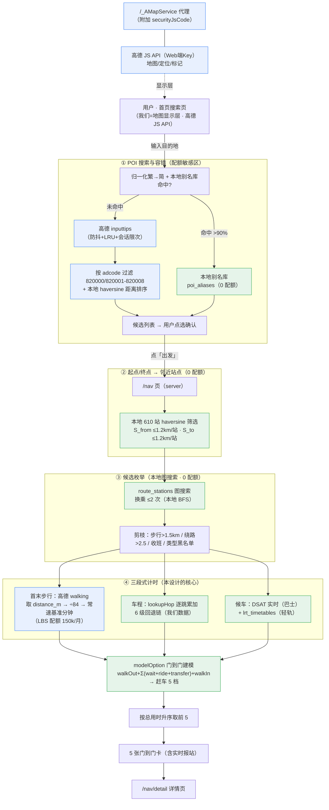
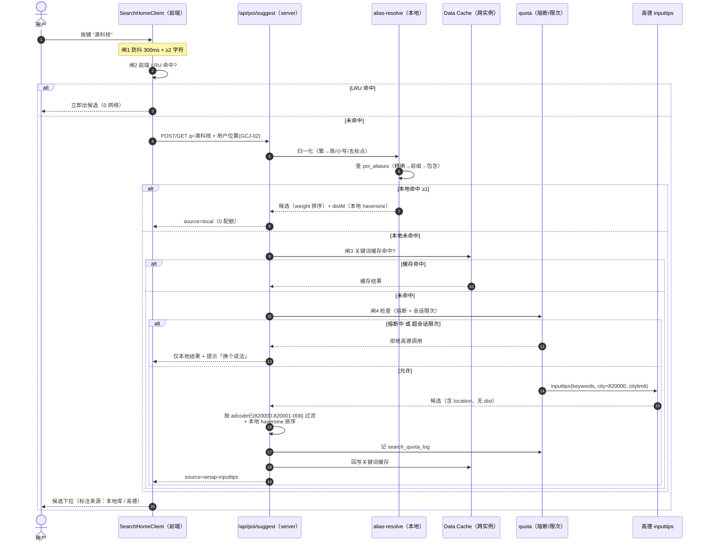
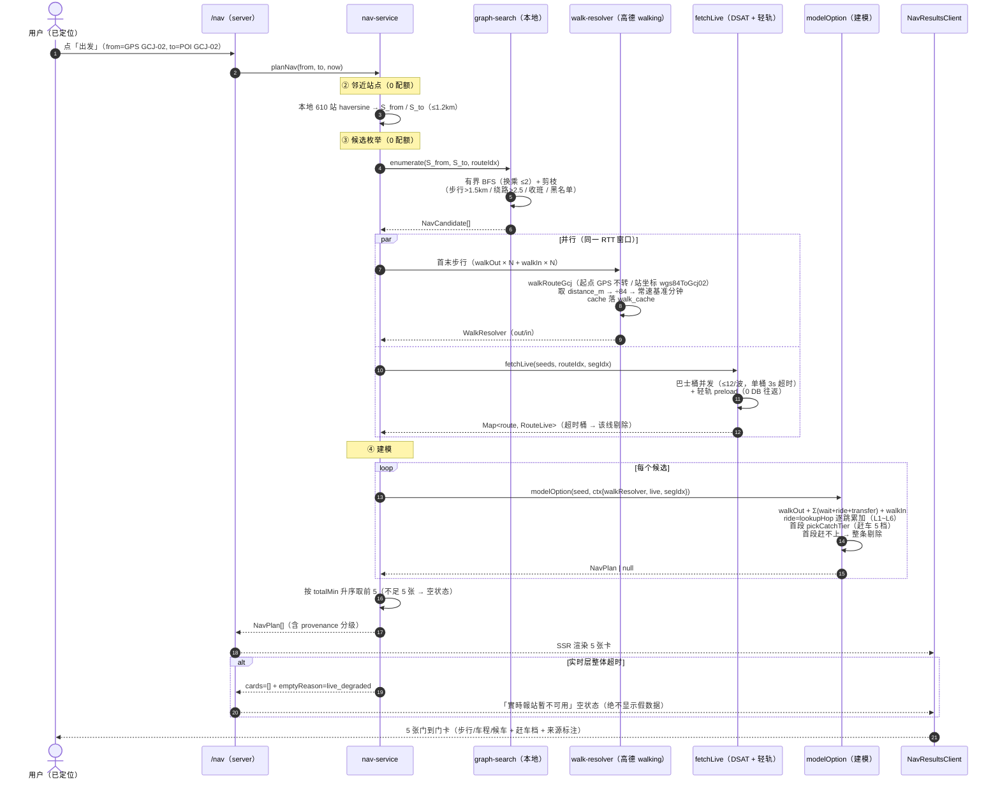

# 系统设计 · 全澳导航（MUST登校 v1.3.0 提案）

> 设计日期：**2026-09-18**　设计人：高见远（架构）
> 项目：**MUST登校**（<https://musttoukou.vercel.app>）　基线版本：**v1.2.2**
> 上游输入：`docs/调研-全澳导航-高德API能力-20260918.md`（许清楚）· `docs/数据盘点-有什么缺什么-20260918.md` · `docs/交接-HANDOVER-2026-09-15.md`
> 本文性质：**系统设计 + 任务分解**，**不含实现代码**。凡涉及具体 API 字段 / 表名 / 函数名，均以「已读代码」或「调研报告实测」为准。
> **标注约定（沿用调研报告）**：`【实测】` = 真机调用或代码可见的事实；`【官方】` = 官方文档；`【推断】` = 本文推断，未经证实；`【未确认】` = 需产品/工程拍板或补测。

---

## 0. 一句话方案

**把「自动选线」从「6 个手工地点 × 14 个手工方案」推广成「任意 POI → 任意 POI」**：目的地靠**本地别名库优先 + 高德搜索兜底**解析，候选靠**我们本地 `route_stations` 图搜索**枚举（零配额、站码天然对齐），三段式计时**步行用高德的距离、车程用我们的 `segment_stats`**，地图作为**显示层地基**引入高德 JS API。旧「自动选线」首页**原样保留**、挪到 `/commute` 通道。

**核心不变量（不得破坏）**：
1. 车程一律**逐跳累加** `segment_stats`（禁「站数 × 常数」）；`lookupHop` 的 6 级回退链原样复用。
2. 步行分钟一律是**「常速基准分钟」**（`distance_m ÷ WALK_BASE_M_PER_MIN(84)`），**分档缩放只在 `catch-up.ts#requiredSec` 做一次**（双重缩档是项目头号红线，见 `client.ts` 头注释 ②、`types.ts:93`）。
3. 坐标系三条铁律（调研 §C4.3）：用户 GPS 不自己转·高德返回坐标原样用·我们库 WGS84 必须 `wgs84ToGcj02()`。
4. 实时数据缺失**绝不造假**：宁可少一张卡，也不出估算卡（v1.0.6 既有口径）。

---

# Part A · 系统设计

## 1. 总体方案与架构图

### 1.1 端到端数据流（Mermaid）



**读图要点**：蓝色 = 高德提供（几何/网络/搜索/地图）；绿色 = 我们自己的数据（图搜索/车程/班次/建模）。**配额敏感的是「①搜索」与「④步行」两处**，其余全在本地内存/自有数据库完成。

### 1.2 关键技术选型与理由

| 决策点 | 选型 | 理由（含反证） |
|---|---|---|
| **候选枚举主力** | **本地 `route_stations` 图搜索**（换乘 ≤2） | `route_stations` = 95 线/610 站/119 方向/2870 行**已全量在手**，**配额 0**、站码天然对齐、`segment_stats` 直接挂得上。高德 `transit/integrated` 需站码映射（探针4：氹仔 94% / 澳科大 3km 82%），且**穿梭巴士噪声** + **站台粒度不够**（高德给「站」我们给「站台」）→ 只作**影子对照**，不作交付源（调研 §C2.2） |
| **首末步行** | **高德 `/v5/direction/walking` 取 `distance`**，**不取 `duration`** | `distance` 是与口径无关的几何量；`duration` 是高德路网速度模型，与「常速基准分钟」口径不同（`client.ts` 头注释 ②）。取 distance 后统一 ÷84，步行口径与我们既有 `walk_times` **完全一致**，赶车 5 档不受影响 |
| **车程** | **我们 `segment_stats` + `lookupHop` 6 级回退链** | 口径一致（DSAT 报站实测，含停站），是用户体感的「到站间隔」。回退层级（≥3 = 估算）**必须透传 UI** |
| **邻近站点发现** | **本地 haversine 从 610 站筛**，**不用 `place/around`** | `place/around` 属**搜索配额（5000/月）**，按调研 §A5.2 单「附近车站」一项就吃掉 3000/月 → 本地筛 0 配额，且我们本来就有坐标 |
| **POI 搜索** | **本地别名库优先 → 高德 `inputtips` 兜底 → `place/text` 正式确认** | 搜索配额 5000/月 是硬约束，超限**静默返回无效结果**（协议 3.7）。三层策略把高德调用压到 ~1350/月（见 §2.A.4 估算） |
| **定位** | **`AMap.Geolocation({ convert:true })`**（JS API，客户端） | `data.position` 已是 GCJ-02，**我们不再自己转**（否则制造偏移） |
| **地图** | **高德 JS API 2.0 + 新增「Web端(JS API)」Key + `/_AMapService` 代理** | Web 服务 Key **不能**用于 JS API【官方】；安全密钥走 Next.js Route Handler 代理**不下发明文**（调研 §A4.3） |
| **图搜索算法** | **手写「有界 BFS / RAPTOR 式标签扩展」（≤2 换乘）** | 规模极小（119 方向 × 平均 ~24 站），无需引 `graphology`/`ngraph` 等通用库；手写可控、可复用既有 `idxsOf`/`segmentsOf`/`deriveDirInMemory` |
| **架构模式** | **沿用现有分层**：静态索引（Data Cache）→ 枚举 → 实时 → 建模 → 编排 | 演进不是重写：**改造点集中在「候选来源」与「步行来源」两处**，下游链路（`model.ts`/`live.ts`/`catch-up.ts`）**原样复用** |

### 1.3 与现有架构的关系（复用 / 新增 / 废弃）

| 现有模块 | 处置 | 说明 |
|---|---|---|
| `src/lib/recommend/enumerate.ts`（`idxsOf`/`segmentsOf`/`deriveDirInMemory`/`strips`） | ✅ **纯复用** | 站序解析与逐跳展开的口径就是图搜索要用的口径，**不重写** |
| `src/lib/recommend/segment-lookup.ts`（`lookupHop` 6 级回退链）、`catch-up.ts`（赶车 5 档） | ✅ **纯复用** | 全澳导航的核心资产，一字不改 |
| `src/lib/recommend/live.ts`（DSAT/轻轨实时分桶并发）、`src/lib/lrt/next-departures.ts` | ✅ **纯复用** | 实时层与「任意 OD」无关，只是桶变多 |
| `src/lib/recommend/model.ts`（`modelOption` 门到门建模） | 🔧 **小改（加接缝）** | 唯一改动：把「步行取值」从「只认 `walk_times`」抽象成 `WalkResolver`，让「高德现算的步行」可注入（见 §2.C） |
| `src/lib/recommend/query.ts#optionsFor`（读 `commute_plans`） | 🔧 **保留但被旁路** | 旧链路（`home-plans`）继续用；新导航走 `nav/enumerate.ts`。**不删** |
| `src/lib/amap/client.ts` | 🔧 **扩展（不改协议）** | 新增 `walkRouteGcj()` 变体（起点已是 GCJ-02、**不再转换**）+ 新增 POI 搜索客户端（`poi.ts`） |
| `src/lib/amap/coord.ts` | ✅ **纯复用** | `wgs84ToGcj02`（误差 0.32m）继续用 |
| `src/app/page.tsx` + `HomeClient.tsx`（旧首页） | 🔀 **迁移到 `/commute`** | 用户确认「保留旧功能、找个通道可达」 |
| `src/app/recommend/*`、`src/app/card/*` | ✅ **保留不动** | 旧功能内部链路，新导航**不碰**它们（避免互相回归） |
| `station_walk_distance`（place 粒度） | 🔧 **升级为通用 `walk_cache`** | 全澳任意点是无限的，不能预扫；改为「按需查询 + 落库缓存」 |
| `commute_plans`/`plan_legs`（14 手工方案/131 腿） | ➖ **不再扩展** | 保留供旧功能；新导航**不依赖**它（这是本次的 P0 前置工程） |

---

## 2. 分模块设计

### A. POI 搜索与容错（需求 3）

**职责**：把用户「多样化 / 可能打错字」的输入，解析成一个**确定的、带坐标的目的地**（`NavPoint`），并保证**搜索配额（5000/月）不超限**。

**输入**：用户按键流（`q` 字符串）+ 用户当前位置（GCJ-02，可空）
**输出**：`PoiSearchResult[]`（按相关度 + 本地距离排序）

**关键文件**（新增）：
- `src/lib/nav/types.ts` — 导航域纯类型（零依赖，client 可 import）
- `src/lib/nav/alias-resolve.ts` — 归一化（繁→简 / 小写 / 去标点）+ 别名库匹配
- `src/lib/nav/poi-search.ts` — 三层搜索编排 + 高德兜底 + adcode 过滤
- `src/lib/nav/quota.ts` — 搜索配额记账 + 熔断（近 4000 次降级为纯本地）
- `src/app/api/poi/suggest/route.ts` — 输入提示接口（公开）

#### A.1 本地别名库设计

**表 `poi_aliases`**（DDL 见 §2.F）：

| 列 | 说明 |
|---|---|
| `alias_norm` | 归一化别名（繁→简、小写、去空格标点）——匹配键 |
| `target_kind` | `station` \| `lrt_station` \| `route` \| `place` \| `poi` |
| `target_code` | `stations.code`（主码口径）/ `routes.code` / `places.slug` / 高德 poi_id |
| `name_tc` | 显示名（繁体，与项目其余 UI 一致） |
| `lng` / `lat` | GCJ-02 坐标（站/地点可直接由 WGS84 转；POI 来自高德） |
| `weight` | 排序权重（校园部位 > 口岸 > 站点 > 通用 POI） |
| `source` | `stations` / `curated` / `amap` —— **溯源，UI 可标「本地库」** |

**冷启动数据来源**（全部离线生成，**不经运行时高德**）：

1. **我们的 610 站 × 95 线**（`stations` / `routes`）→ 每站生成：原繁体名、`mainCodeOf` 主码、去「總站/站/巴士站」后缀、拼音首字母（离线用 `pinyin-pro` 生成）。
2. **高频目的地白名单**（人工整理 ~80~150 条，坐标**离线**用高德 `place/text` 抓一次后落表）：口岸（关闸/横琴/青茂/港珠澳/内港）· 机场 · 码头（氹仔/外港/北安）· 赌场酒店 · 高校（澳大/理工/旅院/科大）· 主要医院 · 主要住宅区。
3. **校内部位**（`places` + 扩展）：B/C·N/O·R 座 · 图书馆 · 体育馆 · 各宿舍名 · `MUST` / `澳科大` / `科大`。
4. **本地缩写与口语**（**高德补不了的部分**，调研 §C3 容错分工表）：
   - 轻轨英文缩写 `lrt` / `light rail`（【实测】高德失败）→ 映射到「轻轨 <近站>」或提示「轻轨站」
   - 葡文地名（`Portas do Cerco` → 关闸 · `Largo do Senado` → 议事亭前地 · `Taipa` → 氹仔）
   - 口岸口语（拱北 / 关闸 / 青茂 / 珠澳 / 横琴，【实测】`gongbei` 高德返回珠海结果）

> **不编造**：`weight` 与白名单条数属**可调初值**；葡文与校园叫法的**完整清单需产品确认**【未确认】。

#### A.2 防抖 / 节流 / LRU / 会话限次（配额保护）

**四道闸（从客户端到服务端逐层收敛）**：

```
按键 ─▶[闸1] 前端 300ms 防抖 + ≥2 字符
      ─▶[闸2] 前端内存 LRU（normalized keyword → 结果，TTL 10min）
      ─▶[闸3] 服务端 Data Cache（unstable_cache，key=normalized keyword，revalidate 1h）
      ─▶[闸4] 会话限次（每 session/IP 最多 5 次高德兜底；超出 → 只用本地层）
      ─▶ 本地别名库命中？（目标 >90%）── 是 ─▶ 秒回，0 配额
                                      └ 否 ─▶ 高德 inputtips（记账 + 熔断检查）
```

- **闸1 防抖 300ms**：`RecommendClient` 同类做法（客户端 `useState` + `setTimeout`）。
- **闸2 前端 LRU**：避免同一用户反复打字重复请求（`lru-cache` 或自写 `Map` + 时间戳）。
- **闸3 服务端 Data Cache**：跨用户命中（热门地名「关闸」「机场」会被大量重复搜）——这是**最省配额的一层**。
- **闸4 会话限次**：`quota.ts` 用令牌桶（per session token，存 cookie 或内存）。防恶意刷。
- **熔断**：月度搜索调用接近 **4000 次**（5000 的 80%）→ 关闭高德兜底层，只留本地层 + `place/text` 单次确认 + 提示「请换个更具体的说法」。记账写 `search_quota_log`（§2.F）。

#### A.3 「高德补不了」的部分怎么落

| 类型 | 归属层 | 落法 |
|---|---|---|
| 错别字（澳科打 / 威泥斯人） | 高德 | 【实测】高德已做，**不用自己写编辑距离** |
| 繁/简/日文汉字 | 高德 + 我们归一 | 高德已做；本地别名库也备一份繁简互搜 |
| 拼音 / 英 / 缩写（`aomen`/`macao`/`MGM`） | 高德 | 【实测】已做 |
| **`lrt`/`light rail`** | **本地** | 高德失败【实测】→ 别名库硬映射 |
| **葡文地名** | **本地** | `langCode=en` 是高级服务需工单【官方】→ 本地补 |
| **校园叫法（B座/N座/R座/MUST/各宿舍）** | **本地** | 高德只有「教学大楼」【实测】 |
| **口岸口语（拱北/青茂/珠澳）** | **本地** | 【实测】`gongbei` 返回珠海 → 本地补 |

#### A.4 输入提示的排序规则（`inputtips` 无 `dist` 字段）

**问题**：【实测】`inputtips` **不返回 `dist`**，且 `location` 就近偏置**效果不明显**（三种 location 结果完全相同）→ 无法靠高德按距离排。
**解法**：`inputtips` **返回了 `location`（GCJ-02 坐标）**【实测】→ **我们自己算距离**：

```
score = w_local * localHitWeight        // 本地别名库命中（如「B座」）→ 极高权重
      + w_campus * campusBonus          // 校内部位 / 口岸 / 高频目的地白名单
      + w_dist  * f(distM)              // f = 由 returned location 与用户位置的 haversine 反比
      + w_rank  * (1 / (1 + i))         // 高德返回序的轻微偏置（保底）
排序前过滤：adcode ∈ {820000, 820001..820008}（去珠海/中山噪声；⚠️ 澳大横琴校区是 440499，需白名单例外）
```

#### A.5 配额估算（目标 ≤5000/月，留 ≥3× 余量）

假设 **DAU 100、每人 1.5 次搜索会话/日 = 150 会话/日**：

| 项 | 单次消耗 | 触发率 | 日消耗 | 月消耗（30 天） |
|---|---|---|---|---|
| 输入提示 → 高德 `inputtips` | 搜索 1 | 本地未命中 **10%** × 每会话 1 次 | 15 | **450** |
| 回车正式搜索 → 高德 `place/text` | 搜索 1 | 会话 **20%** | 30 | **900** |
| 服务端 Data Cache 命中率 | — | 热门地名 ~60% 命中 | （已在上行扣除） | — |
| **「附近车站」** | — | **本地 haversine，0 配额** | 0 | **0** |
| **合计** | | | **45/日** | **≈1,350/月** |

> 余量 3.7×。⚠️ 若不做闸1~闸4、「逐字」直接打 `inputtips`：日活 100 即 **6,000/月**（【实测】测算），**必然超限且静默失效**。⇒ **逐字实时提示必须「本地优先」**，这是本设计的**硬前提**。

---

### B. 候选路线枚举（需求 5 的地基）

**职责**：给定 `S_from`（出发地步行可达的站）与 `S_to`（目的地步行可达的站），枚举出所有合理的「乘车链」候选。

**输入**：`S_from: Set<mainCode>`、`S_to: Set<mainCode>`、`RouteIndex`（内存，来自 `loadStatics`）
**输出**：`NavCandidate[]`（≈ 现有 `OptionSeed` 的泛化版）

**关键文件**（新增）：
- `src/lib/nav/graph-search.ts` — 有界 BFS 图搜索
- `src/lib/nav/enumerate-nav.ts` — 把图搜索路径展开成 `NavCandidate`（复用 `segmentsOf`/`deriveDirInMemory`）
- `src/lib/nav/prune.ts` — 剪枝（换乘上限 / 绕路系数 / 收班 / 类型黑名单）

#### B.1 算法选型

**图模型**：节点 = **站点主码**（`mainCodeOf` 归一，`C690/3 ≡ C690`）；边 = `route_stations` 的相邻站对（带方向：`(route, dir, i → i+1)`）。

**搜索**：**有界 BFS / RAPTOR 式标签扩展**，**换乘次数上限 = 2**。

| 换乘数 | 覆盖场景 | 枚举方式 |
|---|---|---|
| 0（直达） | 某线某方向 `s_from` 在 `s_to` 之前 | 遍历 `dirStops`，用 `idxsOf` 判先后 |
| 1 | `s_from --线A--> X --线B--> s_to` | 从「0 换乘可达集」里每个站再上一条线 |
| 2 | 轻轨 + 巴士混合（如轻轨 → MT1） | 再扩展一轮 |

**为什么上限 2**：竞品（Citymapper/Google/Moovit）几乎不给 3 换乘以上；澳门巴士网密集，实测高德方案也基本 ≤2 换乘；且 3 换乘会让候选爆炸、总时长极少最优。**上限设为常量**（`MAX_TRANSFERS = 2`），便于调。

**复杂度**：`O(rounds × Σ|dirs| × avgStops)`。`Σ|dirs| = 119`、`avgStops ≈ 24` → 单轮 ~2900 次比较；3 轮 < 1 万次运算 → **纯内存毫秒级**，无性能顾虑。

**剪枝**（§调研 §C2.2 建议 + 我们的铁律）：

| 规则 | 阈值 | 依据 |
|---|---|---|
| 总步行（首+末）> 1.5 km | 丢弃 | 调研 §C2.2 |
| 绕路系数（乘车里程 ÷ 直线距离）> 2.5 | 丢弃 | 项目已有绕路系数口径（`docs/地点站点距离-核对表`） |
| 线路**不在运营时段** | 丢弃 | 用 DSAT 实时「无在途车」+ `lrt_timetables` 状态；**高德永不返回空方案**【实测】，此判定必须我们做 |
| **类型黑名单** | 丢弃 | 赌场穿梭巴士（`新濠/美高梅/银河/金沙/伦敦人/威尼斯人/新濠影汇 穿梭巴士`）· 轻轨**在建东线 ES1–ES6**【实测】 |
| 同站台重复链 | 去重 | 复用 `enumerate.ts` 的 `key` 去重口径 |

> ⚠️ **黑名单是「名字」而非类型字段**：【实测】`buslines[].type` 只有「普通公交线路」/「地铁线路」，穿梭巴士也在「普通公交线路」里 → **只能靠线路名黑名单**（【推断】，需回归）。我们的本地图搜索天然只含 DSAT 官方线路，**黑名单主要作用于「高德影子对照」**。

#### B.2 与现有 `enumerate.ts` 的关系：**复用不替换**

- `enumerate.ts` 的 `idxsOf` / `segmentsOf` / `deriveDirInMemory` / `stripCode` = **站序解析与逐跳展开的公共口径** → 图搜索**直接 import 复用**（`enumerate.ts` 本身是纯函数、零 DB 依赖）。
- **新增** `enumerate-nav.ts` 负责「图搜索产出的路径 → `NavCandidate`」的**展开**（每条路径 → 首段上车 × 动态下车，与 `enumerate.ts#enumerateOptions` 同构）。
- **区别**：`enumerate.ts` 的候选来自 `commute_plans` 的 `plan_legs`；`enumerate-nav.ts` 的候选来自 `graph-search.ts` 的输出。**下游 `model.ts` 两者共用**。

#### B.3 站台粒度对齐（`T363/1` vs `/2`）

| 层 | 粒度 | 处理 |
|---|---|---|
| 图搜索 | **主码级**（`T363`） | 节点用 `mainCodeOf` 归一 —— 与 `segment-lookup.ts` 同口径 |
| 逐跳展开 | **站台级** | `segmentsOf(route, from, to)` 从 `dirStops` 里解出**该方向的真实站台码**（`T363/1`），写进 `hops` |
| UI 展示 | **主码级 + 地名** | 显示「T363 連貫公路/威尼斯人」，**不暴露 `/1` `/2`** |
| 高德映射 | **高德站 → 我们的主码** | 坐标法（`gcj02ToWgs84` + 最近邻 ≤60m）+ 名称法（繁简归一）双校验，**双失配则丢弃该候选（不猜）**；映射表 = `station_amap_map`（§2.F） |

> **GPS 精度 vs 站台精度**：GPS 精度 10~50m，站台间距数十米 → 首段步行的**上车站给「就近 2~3 个站台」**而非唯一答案（调研 §C5#10【推断】）。本设计落实为：`S_from` 取 1.2km 内全体站，图搜索在**所有** `S_from` 上跑，最终由「步行时间 + 总历时」自然收敛，不人为指定唯一站台。

---

### C. 三段式计时（需求 5 的核心 · ★ 本设计难点）

**门到门时间轴（与现有 `model.ts` 公式一致）**：

```
T_total = walkOut(出发地 → 上车站)
        + wait₁(实时) + ride₁(逐跳累加)                       ← 第 1 段
        + Σ_{k≥2}[ transferₖ + waitₖ + rideₖ ]               ← 第 2 段起
        + walkIn(下车站 → 目的地)
```

#### C.1 三段来源（★ 关键：口径怎么对齐）

| 段 | 来源 | 单位变换 | 坐标系处理 |
|---|---|---|---|
| **① 我的位置 → 上车站** | 高德 `/v5/direction/walking` → **取 `distance`（米）** | `baseMin = distance_m ÷ 84` | origin = **用户 GPS（GCJ-02，不转）**；dest = 站坐标（**WGS84 → `wgs84ToGcj02()`**） |
| **② 乘车段** | 我们 `segment_stats` + `lookupHop` 逐跳累加 | 已是分钟 | 站码为我们的码，无需转换 |
| **③ 下车站 → 目的地** | 高德 `/v5/direction/walking` → 取 `distance` | `baseMin = distance_m ÷ 84` | origin = 站坐标（WGS84→GCJ02）；dest = **高德 POI 坐标（GCJ-02，原样用）** |

> **★ 为什么取 `distance` 不取 `duration`**：`client.ts` 头注释 ② 明确「高德 `duration` 不能当 `minutes` 用（口径不同 → 双重缩档）」。取 distance 后统一 ÷84，与我们既有 `walk_times` 的「常速基准分钟」**完全同口径**，从而：
> - 赶车 5 档（`pickCatchTier(walkOut.minutes, waitSec, walkOut.distanceM)`）**原样可用**；
> - 档 1 的随距离衰减（`tier1EffRatio`）因为有了 distance 而**始终可算**（现网 `walk_times.distance_m` 常为 NULL，是回退线性）。

#### C.2 回退链与「哪几级是估算」透传 UI

**车程**：沿用 `lookupHop` 6 级（`segment-lookup.ts:123`）：

| 级 | 命中 | 是否实测 |
|---|---|---|
| L1 | 本线·今天·stop | ✅ 实测 |
| L2 | 本线·全周·stop | ✅ 实测 |
| L3 | 本线·全周·all | ✅ 实测（略粗） |
| L4 | **跨线邻接共享** | ✅ 实测（同马路同源） |
| **L5** | **该线单站均值 × 1 跳** | ⚠️ **估算** |
| **L6** | **全局单站均值 × 1 跳** | ⚠️ **估算** |

**步行**：新导航的步行回退（`WalkResolver`）：

| 级 | 命中 | 是否实测 |
|---|---|---|
| W1 | 高德 walking 现算 / `walk_cache` 命中 | ✅ 高德路网（**非我们实测**，标「高德路径」） |
| W2 | 高德失败 → **直线距离 ÷ 84 × 绕路系数 1.3** | ⚠️ **估算** |
| W3 | 完全无坐标 → `WALK_FALLBACK_MIN (3.0)` | ⚠️ **兜底** |

**★ UI 必须分级标注**（沿用现有 `WalkLegView.estimated`（level≥3）+ `RideLegView.levels[]` 机制）：
- 车程 L5/L6 → 段尾标「估算」
- 步行 W2/W3 → 标「估算」；W1 标「高德路径」+ 数据来源徽章
- 卡片级别：若一条卡里**任一段**是 L5/L6/W2/W3 → 卡片角标统一提示「含估算段」（口径诚实，调研 §C1.1/§问题1 推荐 A+C 混合）

#### C.3 三段怎么拼接 + 赶车 5 档怎么套

**接缝在「上车站台」与「下车站台」两个点**（见 §5 时序图②）。要点：

1. **串行推进 `cursor`**（沿用 `model.ts` 现有实现）：`cursor = nowMs + walkOutMs → boardAtMs → … → arriveAt`。
2. **首段锚点**：`walkOut.minutes`（高德距离 ÷84）作为 `baseMin` 传入 `pickCatchTier(baseMin, waitSec, walkDistM)`；`waitSec` 用 DSAT `loSec`（往短了算）或轻轨 `(depMs - nowMs)/1000`。
3. **赶车 5 档位置不变**：只作用于**首段**（`rides[0].tier`），第 2 段起 `tier = null`（沿用 v1.1.3/v1.0.6 口径）。
4. **首段赶不上 → 整条剔除**（`ctx.missed`），**不退回估算卡**（v1.0.6 铁律）。
5. **换乘步行**：优先 `transfer_walks`（我们实测，仅 2 条）；缺失 → **用高德 walking 从「换乘下车点」到「换乘上车站」**（同为距离 ÷84）→ **比用 3 分钟常数估更准**，且标注为「高德路径」。这是本设计对 `transfer_walks` 只有 2 条的现实回答【推断，需验证绕路系数】。
6. **候车**：巴士第 2 段起无第二实时源 → 沿用 `BUS_HEADWAY_FALLBACK_SEC/2` 估（标注「按班次间隔估算」）；轻轨第 2 段起查时刻表（绝对时刻）。**不新增数据源**。

#### C.4 ★ 口径冲突的处理（高德步行 vs 我们车程）

| 风险 | 分析 | 处理 |
|---|---|---|
| **直接相加有系统偏差？** | 高德步行走**路网模型**，我们车程走 **DSAT 报站实测** —— **两者是不同的物理段（步行 vs 乘车），不是同一量的两种测法 → 不存在「双重计数」** | 相加是**对的**；无需校正系数 |
| **接缝处偏差** | 高德步行路径的**末点可能吸附到「最近道路点」而非站台出入口** → 末段被低估/高估 | ① 强制 **snap 自检**（`snapStartM`/`snapEndM` 已由 `client.ts` 返回）；② `snap > 100m` → 该步行标「估算」并记录告警；③ 上线前做**全澳随机 OD 抽样体检**（调研 §6.2#17，已知 7/37 组绕路系数异常） |
| **坐标系漏转 → 步行翻倍** | 项目已踩坑：不转换时步行距离**系统性偏大一倍**（4741m vs 2370m） | ① `walkRouteGcj()` 与 `walkRoute()` **分离**，起点来源决定用哪个；② `toAmapCoords` 保持唯一转换入口；③ 每次调用记 **`coord_mode` 字段**（缓存键的一部分，防混用） |

**校验手段**：内部保留**高德 `transit/integrated` 影子对照** —— 把高德方案与我们的候选做 diff，用于发现「我们漏了哪条线」（零额外配额可离线跑）。【推断】这是最省成本的数据质量监控。

---

### D. 地图地基（需求 7）

**职责**：提供「一进页就显示地图 + 我的位置图标 + 目的地图标」的显示层；线路与巴士实时位置是**远期目标**（本设计只预留数据接口，不实现）。

**关键文件**（新增）：
- `src/components/nav/NavMap.tsx` — 地图容器（**`"use client"` + `next/dynamic({ ssr:false })`**）
- `src/components/nav/MapMarkers.tsx` — 用户点 / 目的地点 / 精度圈
- `src/app/_AMapService/[...path]/route.ts` — 安全密钥代理（Route Handler）
- `src/lib/nav/amap-js.ts` — JS API 加载与安全密钥配置（客户端）

#### D.1 库与加载

- 用 **`@amap/amap-jsapi-loader`**（npm）或等价的手动 `<script src="https://webapi.amap.com/maps?v=2.0&key=...">`；**必须动态 `AMap.plugin()` 按需加载** `AMap.Geolocation`。
- **SSR 处理**：`NavMap` 只能客户端渲染；在 server 组件里用 `next/dynamic(..., { ssr: false })`（否则 `AMap` 未定义直接崩）。
- **性能**：地图实例**只 `new` 一次**（`useRef`），避免 `prefers-color-scheme` / state 变化触发重建（调研 §C4.2 埋点警告：「不要把地图实例放进会频繁重渲染的组件」）。首屏地图放**上方半屏**、搜索框在下方。

#### D.2 定位 / 标记 / 视野

| 目标 | 做法 |
|---|---|
| 用户位置 | `AMap.Geolocation({ enableHighAccuracy:true, timeout:10000, convert:true, showCircle:true, zoomToAccuracy:true })` → `getCurrentPosition`；`data.position` **已是 GCJ-02** |
| 定位失败（PC ~5%【官方】） | 降级：显示全澳视野 + 提示「手动选起点」 |
| 目的地图标 | `new AMap.Marker({ position: [lng,lat] })`，坐标用**高德返回的 POI location 原样** |
| 地图中心/缩放 | 初始：用户位置，zoom 15；选出目的地后：`setFitView([userMarker, destMarker])` |
| 精度圈 | `Geolocation({ showCircle:true })` 或 `AMap.Circle({ radius: accuracy })` |

#### D.3 Key 管理与 `/_AMapService/` 代理

```
① 新增「Web端(JS API)」Key（与现有「Web服务」Key 不通用【官方】）→ NEXT_PUBLIC_AMAP_JS_KEY
② 同应用申领 securityJsCode → 存**服务端**环境变量 AMAP_JS_SECURITY_CODE（不进前端产物）
③ app/_AMapService/[...path]/route.ts：接收 /_AMapService/* 请求，
   追加 jscode=<AMAP_JS_SECURITY_CODE> 后转发到 https://restapi.amap.com/*
   → 前端只设 window._AMapSecurityConfig = { serviceHost: '/_AMapService' }，**不下发明文密钥**
④ middleware.ts：把 /_AMapService 加入 PUBLIC_PREFIXES（否则被口令门 401）
⑤ 域名白名单：控制台配 musttoukou.vercel.app（可选加固）
```

**降级**：若 Vercel 侧代理实现受阻 → **临时**用 `window._AMapSecurityConfig = { securityJsCode }`（明文，调研 §A4.3 明确不推荐生产）。**【未确认】需产品确认代理方案的落地能力**。

**合规**：地图页**必须**显示「本服务来源于高德地图」+ 保留高德 logo/审图号（协议 7.7 / 4.10.7）→ 见 §5.5 与 §2.E。

---

### E. 页面与路由

**路由表**：

| 路由 | 类型 | 职责 | 与现状 |
|---|---|---|---|
| **`/`** | Server + Client 子组件 | **新搜索首页**：上半屏地图（含我的位置）+ 下方搜索框 + 冷启动推荐 + **旧功能通道** | 🔀 **重写**（原 `/` 内容迁到 `/commute`） |
| **`/commute`** | Server | **旧首页**（方向卡 → 自动选线），即现 `HomeClient` 原样 | ➕ **新增**（承载旧功能） |
| **`/nav`** | Server（`Suspense` 流式） | **导航结果页**：5 张门到门卡；参数 `?flng=&flat=&fname=&tlng=&tlat=&tname=&src=` | ➕ **新增** |
| **`/nav/detail`** | Server | **导航详情页**（本功能**不做开发者模式**）：站条 + 换乘 + 文字指引 | ➕ **新增**（复用 `SegmentStrip`/`CardDetailClient` 子件） |
| `/recommend`、`/card`、`/routes`、`/free`、`/stats`、`/records`、`/timer/*` | — | 旧功能内部链路 | ✅ **不动** |
| `/login`、`/about` | — | 口令门 / 合规 | 🔧 `/about` 补高德披露章节 |

**旧功能通道放在哪**：新首页 `/` 底部放一枚**显眼但次级**的入口「**查看我的固定通勤方案（舊功能）**」→ `router.push('/commute')`。`/commute` 就是现 `HomeClient` 的完整能力（方向卡 + 座区 + 开发者入口）。这样**公众首屏是「全澳搜索」，老用户一步可达旧功能**。

**每页职责 / 组件树 / Server↔Client 边界**：

```
/ (server: 只读 places → 冷启动推荐)
└─ <SearchHomeClient>                      "use client"（搜索状态 + 地图协调）
   ├─ <NavMap>  [dynamic ssr:false]        地图 + 我的位置 + 目的地图标
   ├─ <PoiSearchBox>                       防抖输入 + 候选下拉（调 /api/poi/suggest）
   ├─ <ColdStartChips>                     附近车站 / 高频目的地（本地数据，0 配额）
   ├─ <ComplianceBar>                      「本服務來源於高德地圖」
   └─ <Link href="/commute">                旧功能通道

/nav (server: 调 navService → 5 张卡)
├─ <Suspense fallback=<NavSkeleton>>
└─ <NavResultsClient>                      "use client"（刷新 / 分档 / 地图同步）
   ├─ <NavMap>（可复用，显示 O→D + 首站标记）
   └─ <RecommendCards>  ← 复用现有组件    渲染 5 张卡（href 指向 /nav/detail）
      └─ <RecommendCard> ← 复用（加 hrefOverride 属性）

/nav/detail (server: 调 navDetail)
└─ <CardDetailClient> 的**子组件复用**（SegmentStrip / RouteStack / RoutePieces）
   —— 但**去掉**开发者按钮与计时入口（需求 6：先不做开发者模式）
```

**数据获取方式**：
- `/`、`/nav`、`/nav/detail` 用 **Server Component** 直算（SSR，首屏即有内容）；刷新走 `/api/nav`（`force=1` 穿透 10s 缓存）。
- 地图与定位**只在 Client**（JS API 需浏览器 API）。
- **坐标系跨边界**：客户端定位得到 GCJ-02，随查询参数传给 server（**只传坐标，不传 Key**）。

**详情页复用策略**：**新建 `/nav/detail` 但复用组件**（`SegmentStrip` / `RoutePieces` / `RouteStack` / `TierBadge`），**不复用 `/card` 整个页面** —— 因为 `/card` 与 `planId+zone+开发者模式` 强耦合，硬接会波及旧功能。导航详情的数据来源 = `navDetail()`（与 `navService` 同一份实现）。

---

### F. 新增 / 变更的数据表（DDL 雏形）

> 迁移文件：`db/migrate-v1300.ts`（幂等，遵循项目既有 `migrate-vXXXX.ts` 惯例）+ 同步更新 `db/schema.sql`。**生产库改动一律走迁移脚本**（项目铁律）。

```sql
-- F1. 高德站 ↔ 我们 DSAT 站码映射（P0 接缝）
CREATE TABLE IF NOT EXISTS station_amap_map (
    id                SERIAL PRIMARY KEY,
    amap_station_id   TEXT,                 -- 高德站点 id（可能为空，坐标法不依赖它）
    amap_name         TEXT NOT NULL,        -- 高德站名（**简体**）
    amap_lng          NUMERIC(10,6) NOT NULL,  -- GCJ-02
    amap_lat          NUMERIC(10,6) NOT NULL,
    amap_typecode     TEXT,                 -- '150700' 公交站 / '150500' 地铁站(轻轨)
    dsat_station_main TEXT NOT NULL,        -- 我们的**主码**（T363 / C690 / LRT-MUST）
    match_method      TEXT NOT NULL,        -- 'coord' | 'name' | 'both'
    match_dist_m      NUMERIC(6,1),         -- 坐标法最近邻距离
    confidence        NUMERIC(4,3),         -- 双法命中=高，单法=低
    updated_at        TIMESTAMPTZ NOT NULL DEFAULT now(),
    UNIQUE (amap_name, amap_lng, amap_lat)
);
CREATE INDEX IF NOT EXISTS idx_station_amap_main ON station_amap_map (dsat_station_main);

-- F2. 本地地名别名库（配额保护第一层）
CREATE TABLE IF NOT EXISTS poi_aliases (
    id          SERIAL PRIMARY KEY,
    alias_norm  TEXT NOT NULL,              -- 归一化键（繁→简/小写/去标点）
    target_kind TEXT NOT NULL,              -- 'station'|'lrt_station'|'route'|'place'|'poi'
    target_code TEXT,                       -- 站主码 / 线路码 / place.slug / 高德 poi_id
    name_tc     TEXT NOT NULL,              -- 显示名（繁体）
    lng         NUMERIC(10,6),              -- GCJ-02
    lat         NUMERIC(10,6),
    weight      SMALLINT NOT NULL DEFAULT 100,
    source      TEXT NOT NULL DEFAULT 'curated',  -- 'stations'|'curated'|'amap'
    created_at  TIMESTAMPTZ NOT NULL DEFAULT now()
);
CREATE INDEX IF NOT EXISTS idx_poi_aliases_norm ON poi_aliases (alias_norm);
CREATE UNIQUE INDEX IF NOT EXISTS uq_poi_aliases ON poi_aliases (alias_norm, target_kind, COALESCE(target_code,''));

-- F3. 通用步行距离缓存（把 place 粒度的 station_walk_distance 泛化）
--     key 支持三类起点：'place:<slug>' / 'poi:<poi_id 或 lng,lat 取整>' / 'gps:<geohash 或取整>'
CREATE TABLE IF NOT EXISTS walk_cache (
    id            SERIAL PRIMARY KEY,
    origin_kind   TEXT NOT NULL,            -- 'place'|'poi'|'gps'
    origin_key    TEXT NOT NULL,            -- 稳定键（gps 用坐标取整，如 'gps:113.57,22.15'）
    station_main  TEXT NOT NULL,            -- 主码口径
    distance_m    NUMERIC(7,1) NOT NULL,    -- 高德步行路径距离（米）
    duration_s    INTEGER,                  -- 高德自估（**仅参考，不参与建模**）
    coord_mode    TEXT NOT NULL DEFAULT 'gcj02',  -- 传入坐标系（防混用，见 §C.4）
    snap_start_m  NUMERIC(6,1),
    snap_end_m    NUMERIC(6,1),
    fetched_at    TIMESTAMPTZ NOT NULL DEFAULT now(),
    UNIQUE (origin_kind, origin_key, station_main)
);
CREATE INDEX IF NOT EXISTS idx_walk_cache_lookup ON walk_cache (origin_kind, origin_key, station_main);

-- F4. 搜索配额记账（5000/月 硬约束的监控与熔断依据）
CREATE TABLE IF NOT EXISTS search_quota_log (
    id          BIGSERIAL PRIMARY KEY,
    api         TEXT NOT NULL,              -- 'inputtips'|'place_text'|'place_around'
    keyword_norm TEXT,
    hit_local   BOOLEAN NOT NULL DEFAULT FALSE,
    ok          BOOLEAN NOT NULL,
    infocode    TEXT,
    created_at  TIMESTAMPTZ NOT NULL DEFAULT now()
);
CREATE INDEX IF NOT EXISTS idx_search_quota_time ON search_quota_log (created_at DESC);

-- F5.（可选）POI 搜索结果落库缓存（跨实例，避免重复消耗搜索配额）
CREATE TABLE IF NOT EXISTS poi_cache (
    keyword_norm TEXT PRIMARY KEY,
    results      JSONB NOT NULL,            -- PoiSearchResult[]
    fetched_at   TIMESTAMPTZ NOT NULL DEFAULT now()
);
```

**变更说明**：
- `stations` 已有坐标 → 加**空间筛选用的普通索引**（或直接内存 haversine，610 条无需索引）。
- **不新增**「候选缓存表」——候选随实时数据变，用 `service.ts` 的进程内 10s 缓存即可（沿用 `__recCache` 模式）。
- `station_walk_distance` **保留**（旧功能仍在用）；`walk_cache` 是**通用版**，两者可后续合并【未确认】。

---

### G. 前置工程（P0）排期与依赖

| 序 | 前置项 | 内容 | 依赖 | 阻塞谁 |
|---|---|---|---|---|
| **G1** | **站码映射**（`station_amap_map`） | 用探针4 的方法（坐标 ≤60m 最近邻 + 繁简归一名匹配双校验）**离线批量**生成映射表 | `.verify/amap-probe4.ts` 资产 + 我们的 `stations` 坐标 | **不阻塞图搜索**（图搜索不需要它）；**阻塞「高德影子对照」与「高德步行段对齐」** |
| **G2** | **本地图搜索枚举**（`graph-search.ts` + `enumerate-nav.ts`） | 把候选来源从 `commute_plans` 换成 `route_stations` 图搜索 | `route_stations`（已全量在手）· 复用 `enumerate.ts` | ★ **阻塞整个导航出卡**（不做 = 任意 OD 无候选） |
| **G3** | **本地别名库**（`poi_aliases`） | 归一化 + 冷启动（610 站 + 95 线 + 白名单 + 校内部位 + 缩写/葡文） | `stations`/`routes`（已有）+ 白名单（离线抓一次高德） | 阻塞需求 3（搜索容错） |

**排期结论**：**G1 可与 G2/G3 并行**（G1 只影响「高德对照/步行对齐」，不卡出卡）；**G2 是关键路径起点**，**G3 与 G2 并行**。三项都完成后，导航主链路才可端到端跑通。详见 §3 任务表。

---

## 3. 任务分解

> **硬性规则**：≤5 个任务；每任务 ≥3 个文件；第一个任务 = 基础设施/数据地基（本项目为**演进**，故 T01 = 「数据地基 + 接缝工具」）；按功能模块分组，不按单文件拆。

| 任务ID | 任务名 | 负责角色 | 依赖 | 产出文件（新增/修改） | 规模 | 可并行组 |
|---|---|---|---|---|---|---|
| **T01** | **数据地基与接缝工具** | 工程师-数据 | — | `db/migrate-v1300.ts`·`db/schema.sql`·`scripts/rebuild-station-amap-map.ts`·`scripts/seed-poi-aliases.ts`·`src/lib/nav/types.ts`·`src/lib/amap/client.ts`(+`walkRouteGcj`)·`src/lib/amap/poi.ts`·`src/lib/nav/walk-cache.ts` | **L** | 独立 |
| **T02** | **POI 搜索与容错链路** | 工程师-搜索 | T01 | `src/lib/nav/alias-resolve.ts`·`src/lib/nav/poi-search.ts`·`src/lib/nav/quota.ts`·`src/app/api/poi/suggest/route.ts` | **M** | **组A**（∥ T03） |
| **T03** | **候选枚举 + 三段式计时引擎** | 工程师-引擎 | T01 | `src/lib/nav/graph-search.ts`·`src/lib/nav/enumerate-nav.ts`·`src/lib/nav/prune.ts`·`src/lib/nav/walk-resolver.ts`·`src/lib/recommend/model.ts`(接缝小改)·`src/lib/nav/nav-service.ts`·`src/app/api/nav/route.ts` | **L** | **组A**（∥ T02） |
| **T04** | **地图地基 + 新页面 + 旧功能通道** | 工程师-前端 | T02, T03 | `src/components/nav/NavMap.tsx`·`src/components/nav/PoiSearchBox.tsx`·`src/components/nav/MapMarkers.tsx`·`src/app/_AMapService/[...path]/route.ts`·`src/app/page.tsx`(重写)·`src/app/commute/page.tsx`·`src/app/nav/page.tsx`·`src/app/nav/detail/page.tsx`·`src/components/RecommendCard.tsx`(加 `hrefOverride`)·`src/middleware.ts` | **L** | 组B |
| **T05** | **合规 + 空状态 + 联调回归** | 工程师-联调 | T04 | `src/app/about/page.tsx`·`src/components/nav/ComplianceBar.tsx`·`src/components/nav/EmptyStates.tsx`·`.verify/e2e-nav-*.ts`·`docs/上线-全澳导航-*.md` | **M** | 组C |

### 3.1 关键路径（串行卡住整体）

```
T01（数据地基）──▶ T03（枚举+计时引擎）──▶ T04（地图+页面）──▶ T05（合规+回归）
                        ▲
        T02（搜索）─────┘（T04 同时依赖 T02 的搜索框）
```

- **关键路径 = T01 → T03 → T04 → T05**（**T01 与 T03 是硬串行**：没有映射/别名/`walkRouteGcj` 接缝，引擎无法验证）。
- **T02 不在关键路径上**（与 T03 并行；但 **T04 依赖 T02**，故 T02 若拖到 T04 之前才完成，仍会推迟 T04）。

### 3.2 可并行组

| 组 | 任务 | 说明 |
|---|---|---|
| **组A** | **T02 ∥ T03** | 两者只共同依赖 T01，**产出文件零重叠**（搜索链路 vs 引擎链路）→ 可两名工程师同时开工 |
| 组B | T04（单独） | 依赖 T02+T03 完成 |
| 组C | T05（单独） | 依赖 T04 |

> ⚠️ **T01 内的并行**：`rebuild-station-amap-map`（G1）与 `seed-poi-aliases`（G3）互不依赖，可由同一人在 T01 内分两步做，或拆给两人同时做（**不需拆成两个任务**，符合 ≤5 限制）。

---

## 4. 接口与数据结构（TypeScript）

> **原则**：能复用就复用。`RideSegment`/`TransferSegment`/`WalkLegView`/`RideLegView`/`TransferView`/`CatchTier`/`SegmentLevel` **全部沿用现有 `src/lib/recommend/types.ts`**，不另起炉灶。

```ts
/* ===== src/lib/nav/types.ts（新增；纯类型，零依赖，client 可 import） ===== */

/** 导航端点（坐标一律 GCJ-02） */
export interface NavPoint {
  kind: "gps" | "poi" | "station" | "place";
  label: string;            // 展示名（繁体）
  lng: number;              // GCJ-02
  lat: number;              // GCJ-02
  code?: string;            // station 主码 / place.slug
  poiId?: string;           // 高德 poi_id
  adcode?: string;          // 澳门外来结果过滤用
}

/** POI 搜索结果（§2.A） */
export interface PoiSearchResult {
  source: "local" | "amap-inputtips" | "amap-text";
  name: string;             // 显示名
  address?: string;
  district?: string;
  adcode?: string;
  lng: number;              // GCJ-02（本地库中已转好的为 GCJ-02）
  lat: number;
  kind: "station" | "lrt_station" | "poi" | "place";
  distM: number | null;     // 本地 haversine 到用户位置（排序用，§2.A.4）
  score: number;            // 综合排序分
}

/** 别名库行（§2.A.1） */
export interface AliasEntry {
  aliasNorm: string;
  targetKind: "station" | "lrt_station" | "route" | "place" | "poi";
  targetCode: string | null;
  nameTc: string;
  lng: number | null;
  lat: number | null;
  weight: number;
  source: "stations" | "curated" | "amap";
}

/** 高德站 ↔ 我们主码映射（§2.B.3） */
export interface StationAmapMap {
  amapName: string;
  amapLng: number; amapLat: number;
  dsatStationMain: string;
  matchMethod: "coord" | "name" | "both";
  matchDistM: number | null;
  confidence: number;
}

/** 步行取值结果（§2.C.2；与现有 WalkLegView 同构，level 语义扩展） */
export interface WalkInfo {
  minutes: number;          // ★ 常速基准分钟（distance_m ÷ 84）
  distanceM: number | null;
  toLabel: string;
  /** W1 高德路径 · W2 直线估算 · W3 常数兜底（新语义，与旧 level 1~5 并存于映射层） */
  source: "amap" | "amap-cache" | "straight-estimate" | "fallback";
  estimated: boolean;       // source ∈ {straight-estimate, fallback} → true
  samples: number;
}

/** 步行提供者（注入 model.ts 的接缝，§2.C） */
export interface WalkResolver {
  /** 出发地 → 上车站 */
  out(stationMain: string): WalkInfo;
  /** 下车站 → 目的地 */
  in(stationMain: string): WalkInfo;
}

/** 候选（≈ OptionSeed 的泛化版：去掉 planId/slug，改为 point） */
export interface NavCandidate {
  id: string;                       // 稳定键（去重用）
  from: NavPoint;
  to: NavPoint;
  segments: RideSegment[];          // ★ 复用现有类型
  transfers: TransferSegment[];     // ★ 复用现有类型
  crossBorder: boolean;
  key: string;                      // route@board>alight 链（与 enumerate.ts 同口径）
}

/** 一张导航卡（≈ RecommendCard 的泛化；§2.E） */
export interface NavPlan {
  id: string;                       // 稳定 hash
  rank: number;                     // 1..5
  totalMin: number;
  arriveAt: number;                 // ms
  walkOut: WalkLegView;             // ★ 复用现有视图类型
  walkIn: WalkLegView;
  rides: RideLegView[];             // ★ 复用
  transfers: TransferView[];        // ★ 复用
  crossBorder: boolean;
  /** 数据来源透传（UI 分级标注，§2.C.2） */
  provenance: {
    walkOut: WalkInfo["source"];
    walkIn: WalkInfo["source"];
    rideLevels: SegmentLevel[][];   // 每段每跳的命中层级（≥3 = 估算）
    hasEstimate: boolean;           // 任一 L5/L6/W2/W3 → true
  };
}

/** 空状态枚举（§5.5） */
export type NavEmptyReason =
  | "closed_hours"        // 收班时段
  | "no_coverage"         // 郊区无覆盖
  | "cross_border"        // 跨境（不含通关）
  | "unopened_station"    // 未开通站（ES1-ES6）
  | "too_close"           // 太近（建议步行）
  | "live_degraded"       // 实时层整体超时
  | "none";               // 正常
```

**与现有类型的关系**：

| 现有 | 导航复用方式 |
|---|---|
| `RideSegment` / `TransferSegment`（`types.ts:202/212`） | **直接复用**（`NavCandidate.segments/transfers`） |
| `WalkLegView` / `RideLegView` / `TransferView` / `RecommendCard`（`types.ts:357/375/426/459`） | **直接复用**为渲染形状；`NavPlan` 与之结构兼容 |
| `RecommendCard.tsx` / `RoutePieces.tsx` / `RouteStack.tsx` | **组件复用**：给 `RecommendCard` 加可选 `hrefOverride?: string`，导航传入 `/nav/detail?...`；其余渲染逻辑不改 |
| `OptionSeed`（`types.ts:222`） | 保留给旧功能；`NavCandidate` 是它的**泛化兄弟**（不替换） |
| `SegmentLevel`（`segment-lookup.ts:25`） | **直接复用**到 `provenance.rideLevels` |

---

## 5. 程序调用时序图（Mermaid）

### ① 「用户输入 → 输入提示」（含配额保护）



### ② 「点出发 → 出 5 张卡」（含实时报站、并行调用、超时降级）



---

## 6. 依赖包与共享约定

### 6.1 新增 npm 包

```jsonc
// dependencies
"@amap/amap-jsapi-loader": "^1.0.1",   // 高德 JS API 动态加载器（客户端地图/定位）【推断：需确认版本可用性】
// devDependencies（仅离线脚本用，不进产物）
"pinyin-pro": "^3.26.0",               // 生成站名/地名的拼音首字母别名（seed-poi-aliases）
"opencc-js": "^1.0.5"                  // 繁→简归一（别名库 + 站名映射）
```

> **明确不引入**：图算法通用库（`graphology`/`ngraph`/`dijkstra`）—— 规模太小，手写有界 BFS 更可控且能复用既有站序函数。可选 `lru-cache@^11` 用于服务端关键词 LRU（也可自写 `Map`）。

### 6.2 跨文件共享约定

| 类别 | 约定 |
|---|---|
| **命名** | 导航域新代码一律放 `src/lib/nav/`、`src/components/nav/`、`src/app/nav/`；**不修改** `src/lib/recommend/**` 的对外行为（只加接缝） |
| **坐标系** | ① 用户 GPS：`AMap.Geolocation({convert:true})` → **已是 GCJ-02，不转**；② 高德返回坐标：**原样用**；③ 我们库坐标：上地图/传高德前 **必须 `wgs84ToGcj02()`**。**跨模块传递坐标时在类型注释里写明系**（`NavPoint` 全部 GCJ-02） |
| **坐标系防错** | `walkRouteGcj()`（起点已 GCJ）与 `walkRoute()`（起点 WGS84）**函数名区分**；`walk_cache.coord_mode` 入库，缓存键含它 |
| **口径** | 步行分钟**只能是** `distance_m ÷ WALK_BASE_M_PER_MIN(84)`（常速基准）；**分档缩放只在 `catch-up.ts#requiredSec` 一次**。禁双重缩档 |
| **错误处理** | 服务端 API 返回统一 `{ ok: boolean, data?, error? }`（沿用 `/api/card` 现有形状）；UI 文案走中文（繁体，与现有 UI 一致） |
| **降级策略** | 高德步行失败 → 直线 × 1.3 估（标「估算」）；实时超时 → 该线剔除（不造假）；全部失败 → 空状态 + 明确原因 |
| **UI 标注规范** | 步行来源：`高德路徑` / `估算`；车程 `level ≥3` → `估算`；卡片含估算段 → 角标「含估算段」；**所有含高德的页面必须显示「本服務來源於高德地圖」** |
| **配额** | 搜索类调用**必须**经 `quota.ts`（记账 + 熔断）；步行类走 `walk_cache`（先查后调） |
| **缓存分层** | 静态行 → Vercel Data Cache（`unstable_cache`，跨实例）；索引 → 进程内 60s（`__recStaticCache` 模式）；结果 → 进程内 10s（`__recCache` 模式）。**Map 不可整体缓存**（会静默变 `{}`，项目教训） |

---

## 7. ⚠️ 待明确事项（给产品负责人的问题）

> 每条给选项 + 我的推荐 + 理由。

**Q1. 交付范围：白名单高频目的地，还是全量任意 POI？**
- A：**白名单收敛**（口岸/机场/码头/赌场/高校/医院/主要住宅区 + 任意可搜但排序兜底）
- B：全量任意 POI（`place/text` 全开）
- C：先只做「任意地点 ↔ 澳科大」
- **推荐 A**（PM 亦推荐分两阶段）。理由：既验证「全澳导航」技术路径，又**不把 3.8% 实测覆盖率**的短板一次性暴露；白名单让搜索配额与质量都可控。

**Q2. 车程数据缺口：一致性 vs 交付速度？**
- A：走廊内实测、走廊外**明示估算**（L5/L6）
- B：暂停开发，先补采全澳主干线
- C：走廊外直接用**高德路网时长**
- **推荐 A + C 混合**（实测 → 高德路网 → 站均，三档 UI 标注）。理由：诚实且可交付。⚠️ **需产品确认「同 App 内两个口径」可接受**【未确认】。

**Q3. 搜索交互：逐字实时 vs 回车搜索？**
- A：本地逐字实时 + 高德回车（推荐）
- B：纯回车搜索（省配额，交互差）
- C：付费买搜索流量包（**协议 4.9 禁止多账号**，付费即落商业使用，与个人研究冲突 🔴）
- **推荐 A**。理由：唯一合规且体验尚可的选择；但**「逐字是否必须秒级」需产品确认**。

**Q4. 地图 Key 与安全密钥的落地方式？**
- A：**Next.js `/_AMapService/` 代理**（不下发明文）
- B：前端明文 `securityJsCode`（不推荐生产）
- **推荐 A**；**B 仅作代理受阻时的临时降级**。⚠️ 需确认「Web端(JS API) Key 是否已申请」【未确认】。

**Q5. 阶段边界：是否本期就放开「任意 A → 任意 B」？**
- A：本期放开通用 A→B，但目的地**白名单优先排序**
- B：本期只做「任意 → 高频目的地」
- **推荐 A**。理由：图搜索本身是通用的，硬限反而是额外工作量；用**排序 + 空状态**收敛质量即可。

**Q6. 换乘步行（`transfer_walks` 仅 2 条）怎么兜？**
- A：**用高德 walking 现算换乘步行**（距离 ÷84，标「高德路徑」）—— 本设计主推
- B：继续用 3 分钟常数估（标「估算」）
- **推荐 A**。理由：比常数准；代价是每次换乘候选多 1 次步行调用（LBS 配额充裕）。⚠️ 需上线前抽样验证绕路系数【未确认】。

**Q7. 无 JS API Key / 高德不可用时的地图降级？**
- A：显示「地图暂不可用」占位 + 搜索与出卡**照常**（地图是增强不是依赖）
- B：整页降级
- **推荐 A**。理由：与项目「不把可用性押在高德上」的既有原则一致（协议 9.2/9.3）。

---

## 附录 · 三个「最危险的假设」自评

> 供批判性审查（T04）重点攻击。

1. **「候选枚举走本地图搜索即可复现高德的覆盖」**——若我们的 `route_stations` 站序与真实运营有偏差（缺环线处理 / 站台拆分），图搜索可能**漏掉高德能给的好方案**。缓解：保留高德 `transit` 影子对照 diff。**这是最可能导致「导航不如高德」的假设。**

2. **「高德 `distance ÷ 84` 与我们实测步行同口径」**——该项目假设未被全澳验证（已知 7/37 组绕路系数异常）。若高德步行路径在澳门某些区域系统性绕远，则 `walkOut/walkIn` 会整体偏大，进而**压档**（把「能赶上」算成「赶不上」）。缓解：全澳随机 OD 抽样体检 + snap 自检。

3. **「搜索配额压到 ~1350/月」**——依赖「本地别名库命中率 >90%」这一**未验证指标**。若校园/口岸长尾比预期长，高德兜底触发率会远高于 10%，**可能在月中静默超限**（协议 3.7 不报错）。缓解：`search_quota_log` 实时监控 + 4000 次熔断。
