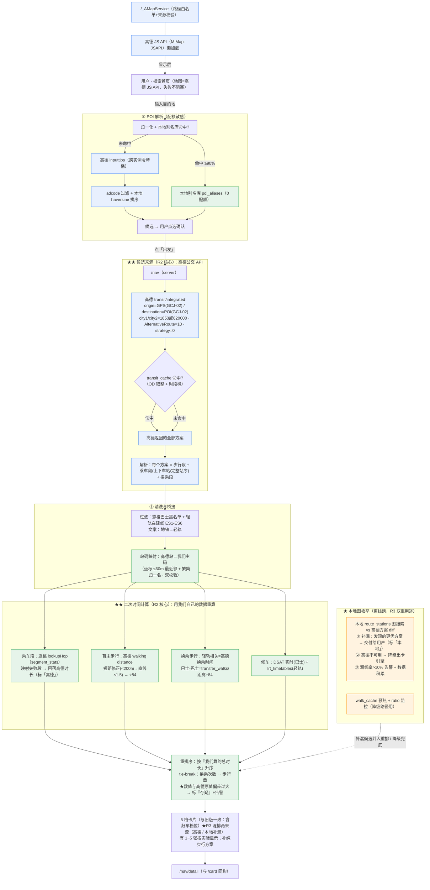

# 系统设计 · 全澳导航（MUST登校 v1.3.0 提案 · **修订 R5**）

> 设计日期：**2026-09-18**　修订：**R1（回应 QA）→ R2（产品否决核心选型）→ R3（4 项微调）→ R4（UI/UX + 自检）→ R5（最后一次小修：Q3/Q11 闭环 + 繁简/地图视角）**　设计人：高见远（架构）
> 项目：**MUST登校**（<https://musttoukou.vercel.app>）　基线版本：**v1.2.2**
> 上游：`docs/调研-全澳导航-高德API能力-20260918.md` · `docs/数据盘点-有什么缺什么-20260918.md` · `docs/交接-HANDOVER-2026-09-15.md`
> 审查：`docs/审查-全澳导航方案-批判性-20260918.md`（QA 严过关）· `.verify/qa-*.out.txt`
> **R4 范围**：新增 **§11 UI/UX 设计规范（YouTube/Google 级）+ 线路名标签规范**、**§12 开工前自检清单**、**§13 R4 修订记录**。
> **R5 范围（最后一次小修）**：Q3 搜索交互 = 方案 A（打字本地/回车高德，配额≈600/月）· Q11 = 轻量同意说明 · 繁简规则（界面简体/站名繁体）· 地图默认视角（+定位失败=全澳视角）· 起点不记忆。**详见 §14。**
> 标注约定：`【实测】`=真机/代码/DB 事实；`【官方】`=官方文档；`【推断】`=推断；`【未确认】`=需拍板/补测。

---

## 0. 一句话方案

**候选主要来自高德，时间由我们算，顺序由我们排；我们自己枚举出的更优方案也一并出给用户。** 用户输入目的地 → 解析成 POI（本地别名库优先 + 高德搜索兜底）→ 点「出发」→ 调**高德公交路径规划**（`AlternativeRoute=10`）拿到它的**全部方案** → 过滤噪声（穿梭巴士 / 在建轻轨 ES1-ES6）→ **站码映射到我们的站**（**自动生成 + 人工维护**的映射表）→ **用我们自己的 `segment_stats` 逐跳重算车程、用高德几何算步行** → 叠加**本地图枚举发现的、高德没给的更优方案** → **按「我们算出的总时长」统一重排序** → 出与旧版**完全一致**的 5 档卡片与详情页。

### ★ 核心不变量（R3 定稿）

1. **候选来源 = 高德公交 API**（`transit/integrated` + `AlternativeRoute=10`）**＋ 本地图枚举补漏**（产品功能，见 §2.B.5）；**我们是后处理器**（重算 + 重排），不重造主路线引擎。
2. **车程一律逐跳累加 `segment_stats`**（禁「站数×常数」）；`lookupHop` 6 级回退链原样复用；映射失败的段回落高德时长并**标注「高德」**。
3. **首末步行 = 常速基准分钟**（`distance_m ÷ WALK_BASE_M_PER_MIN(84)`），**含短距修正**（`直线<200m → 直线×1.5`）；**换乘步行**为独立小节（轻轨相关=高德换乘时间 / 巴士-巴士=我们模型，即 `distance ÷ 84`）。
4. **分档缩放（`SPEED_RATIO`）只作用于首段步行**（`catch-up.ts#requiredSec`）；换乘/末段步行**从不**缩放 ⇒ 换乘用高德时间**不构成双重缩档**。
5. **坐标系三铁律**：用户 GPS 不自己转 · 高德返回坐标原样用 · 我们库 WGS84 必须 `wgs84ToGcj02()`。
6. **呈现与旧版完全一致**：卡片含「赶车 5 档」文案、详情页同 `/card`；**新版步行全部用新口径**（高德距离÷84 + 短距修正），**不加来源小字**（产品 2026-09-18 定）。
7. **高德调用受跨实例限流**（QPS 3/s 全 Key 共用）；**高德不可用 → 自动降级为「本地图枚举 + `walk_cache`」出卡**（正式降级路径，见 §2.B.6）。

---

## 1. 总体方案与架构图

### 1.1 端到端数据流（R2）



**读图要点（R3）**：候选来源（蓝）为**高德 transit**；**我们的价值集中在绿色块**——站码桥接 + **用自有数据重算车程/重排序**。橙色 = **本地图枚举**（离线跑：① 补漏候选**交付给用户**、② 高德不可用时的**降级出卡引擎**）——**不阻塞主路径出卡**，但 R3 起**影响交付质量**（见 §B.5/§B.6）。

### 1.2 关键技术选型（R2）

| 决策点 | 选型 | 理由 |
|---|---|---|
| **候选来源** | ★**高德 `transit/integrated`（`AlternativeRoute=10`，驼峰）** | 产品 2026-09-18 定：高德**已枚举好**（含上下车站/完整站序/步行段），我们不必重造引擎；且高德知道我们未必掌握的换乘关系 |
| **我们的角色** | ★**二次时间计算 + 重排序** | 我们的**真正优势**是一次实测的车程数据（`segment_stats`，邻接对覆盖 **89.0%**【实测】）→ 用它把高德方案重算/重排 |
| **乘车段时长** | 我们的 `lookupHop` 逐跳累加（L1~L4 实测 / L5-L6 估算） | 口径一致；映射失败段回落高德时长并标「高德」（见 §2.C.4） |
| **首末步行** | 高德 transit 返回的 **walking `distance`** → **短距修正** → `÷84` | 高德方案自带首末步行段（**无需再逐站调 walking API**）|
| **换乘步行** | 轻轨相关 → 高德换乘 `duration`；巴士-巴士 → 我们模型 | 产品口径（见 §2.C.5）|
| **排序判据** | **我们算出的门到门总时长升序**；tie-break 换乘次数→步行量 | 产品：「把更快的方案放上面」 |
| **本地图搜索** | ★**离线跑，双重用途**：① 补漏 → **发现的更优方案也出给用户**（产品功能，R3）；② 高德不可用时的**降级出卡引擎** | 保留 R1 的图搜索设计（复用 `enumerate.ts` 纯函数 + 有界 BFS）；补漏与降级共用同一实现 |
| **呈现** | 与旧版**完全一致**（5 档卡片 + `/card` 式详情页）| 产品明确要求 |
| **地图** | 高德 JS API 2.0 + `M Map-JSAPI` + `/_AMapService` | 产品已拍申请 Key ✓ |

### 1.3 与现有架构的关系（R2）

| 模块 | 处置 |
|---|---|
| **`src/lib/amap/client.ts`** | ✅ **保留原样**（步行，离线/预热用）；**新增 `src/lib/amap/transit.ts`**（公交路径，请求期用，受限流）—— 两者分离 |
| **`segment-lookup.ts#lookupHop`** | ✅ **纯复用**（二次计算的核心）|
| **`catch-up.ts`（赶车 5 档）** | ✅ **纯复用**（R2 下 `baseMin` 来自高德几何，见 §2.C.7 的可信度说明）|
| **`live.ts` / `lrt/next-departures.ts`** | ✅ **纯复用**（候车）|
| **`model.ts#modelOption`** | 🔧 中改（`walkResolver` 可选字段 + 适配层，见 §2.C.7 / 附录 R1-P1-5）；旧链路零波及 |
| **`RecommendCard.tsx` / `CardDetailClient`** | ✅ **组件复用**（产品要求与旧版一致）|
| **`enumerate.ts`（图搜索原语）** | 🔧 **改用途**：由「候选主力」→「**补漏（出给用户）+ 降级出卡**」双用途（纯函数仍复用）|
| **`commute_plans`/`plan_legs`（旧 14 方案）** | ➖ 不扩展（旧功能继续用）|
| **`src/app/page.tsx`+`HomeClient`** | 🔀 迁到 `/commute` |
| **`middleware.ts`** | 🔧 必须加白名单（R1-P1-1）|
| **`station_walk_distance` / 计划中的 `walk_cache`** | 🔧 R2 降级为**降级路径**用（高德不可用时）|

---

## 2. 分模块设计

### A. POI 解析（需求 3）

**职责 / 输入输出 / 关键文件**：同 R1（`src/lib/nav/{alias-resolve,poi-search,quota}.ts` + `src/app/api/poi/suggest/route.ts`）。
- 本地别名库 `poi_aliases`（610 站 × 95 线 + 白名单 + 校内部位 + 缩写/葡文）——同 R1，**不变**。
- 四道闸（300ms 防抖 / 前端 LRU / Data Cache / 会话限次）+ 熔断（近 4000 停高德兜底**且同时停 `place/text`**）+ DAU 敏感性 ——同 R1（§8-P1-3）。

> **R2 影响**：POI 解析**不受影响**（它本来就是高德 + 本地别名库）。唯一变化：确认后的 POI 坐标（GCJ-02）直接作为 **transit 的 destination**。

#### A.6 ★R5：搜索交互已定（方案 A）与配额重算

**产品 2026-09-18 拍板：搜索交互 = 方案 A「本地逐字 + 高德回车」**：
- **打字阶段**：**只查本地别名库**（`alias-resolve`，**0 配额**，秒回）；**不发任何高德请求**。
- **回车阶段**：**才调高德**（`place/text` 正式搜索；必要时 `inputtips`）——这是**唯一**消耗搜索配额的时机。

**配额重算（比 R1 的 ~1350/月 更低）**：
| 项 | 单次 | 触发率 | 月消耗（DAU 100、1.5 会话/人/日）|
|---|---|---|---|
| 打字逐字提示 | 搜索 0（**纯本地**）| 100% | **0** |
| 回车正式搜索（高德）| 搜索 1 | 会话 ~40% | ≈**600/月** |
| 服务端 Data Cache 命中 | — | 热门地名 ~60% | （已扣）|
| **合计** | | | **≈600/月**（配额 5000，余量 **8×**）|
> ⚠️ 升级点：打字 0 配额使 DAU 从 100 涨到 **300 仍仅 ~1800/月**（原方案 DAU300 会逼近 4000 熔断）⇒ **方案 A 对「推广」友好得多**。

**★ 已知取舍（必须写明，不是 bug）**：**打字时看不到「新地名」的提示** —— 因为逐字阶段不联网。用户输入一个本地别名库没有的新地名时，**下拉区不会有任何候选**（直到按回车才去高德搜）。**这是方案 A 的固有代价，需在产品文案/引导中说明。**

**★ 本地别名库未命中时，用户怎么知道？（设计）**
| 状态 | 下拉区呈现 |
|---|---|
| 本地**有**命中 | 正常候选列表（秒回）|
| 本地**无**命中、且输入 ≥2 字符 | **一行灰字提示**：「**沒有本地結果 · 按回車搜尋網上新地點**」（`--on-surface-var` 灰字，**不是错误色**）——**明确告知「要回车」**，避免用户以为坏了 |
| 回车后高德**有**结果 | 候选列表（**每条标「來自高德」**来源徽章）|
| 回车后高德**无**结果 | 行内提示「找不到這個地點，試試換個說法」|

> **实现落点**：T02（`poi-search.ts` 的两段式：`suggestLocal()` 打字用 / `searchAmap()` 回车用；`/api/poi/suggest` 增加 `mode=enter` 参数）。

### ★ B. 候选来源（R2 重写 · R3 补人工映射表与补漏交付）

#### B.1 请求期主路径：高德 transit

```
GET https://restapi.amap.com/v5/direction/transit/integrated
  origin      = <用户 GPS 的 GCJ-02 lng,lat>       ★不再做「本地邻近站筛选」
  destination = <POI 的 GCJ-02 lng,lat>            ★高德返回的坐标原样用
  city1/city2 = 1853（citycode）或 820000（adcode） ★【实测】必填，只吃 citycode/adcode
  strategy    = 0（推荐，同高德 App）
  AlternativeRoute = 10                            ★【实测】驼峰，取值 1~10；小写被静默忽略
  show_fields = cost,transits
```

**为什么不再需要「邻近站筛选 / S 半径 / K 站」（主路径）**：高德 transit 返回的方案里**已经指定了上车站与下车站**，并给出「起点→上车站」「下车站→终点」的**步行段距离** ⇒ R1 的 Q8（半径 700m / K=8）**在主路径作废**（**降级路径仍用**，见 §B.6 / §9）。

#### B.2 方案解析（用高德返回结构）

每个方案（`transits[i]`）→ 按顺序解析 `segments[]`：

| 段 | 高德字段 | 我们的用途 |
|---|---|---|
| 首段 `walking` | `distance`（米）、`cost.duration` | **walkOut**（`distance` → 短距修正 → ÷84）|
| `bus` 段 | `buslines[].name/type`、`departure_stop`、`arrival_stop`、`via_stops[]`（完整站序，含坐标）、`cost.duration` | **乘车段骨架**（上/下车站 + 逐跳站序）|
| 中间 `walking` | `distance` / `cost.duration` | **换乘步行**（按产品口径二分，见 §2.C.5）|
| 末段 `walking` | `distance` | **walkIn** |

#### B.3 ★ 必须处理的三件事

**(a) 站码映射（高德站 → 我们主码）★R3：自动生成 + 人工维护**

产品 2026-09-18 拍板：**「站名进行手动匹配」** ⇒ 映射表是**人工维护的长期资产**，不是一次性脚本产物。

**① 两阶段生成**
- **阶段 1（自动）**：**坐标法**（高德站 GCJ-02 → `gcj02ToWgs84()` → 与 `stations` WGS84 最近邻 ≤60m）+ **名称法**（繁简归一 + 去「總站/站/公交站」后缀）；**双法交叉验证** → 自动填充 `station_amap_map`，`verified_by_human=false`。
  - 【实测】自动映射成功率：**氹仔 94% / 澳科大 3km 82%**（探针4）⇒ **6~18% 未自动对齐**。
- **阶段 2（人工）**：自动产物**导出为便于核对的表格**（CSV + Markdown），由人工逐条确认/纠正/补漏 → 回写 `verified_by_human=true` + `verified_at`。

**② 表结构（在 R2 的 `station_amap_map` 上加人工确认标记位）**
```sql
ALTER TABLE station_amap_map ADD COLUMN IF NOT EXISTS verified_by_human BOOLEAN NOT NULL DEFAULT FALSE;
ALTER TABLE station_amap_map ADD COLUMN IF NOT EXISTS verified_at TIMESTAMPTZ;
ALTER TABLE station_amap_map ADD COLUMN IF NOT EXISTS verified_note TEXT;   -- 人工备注（如「改名」「新建」）
ALTER TABLE station_amap_map ADD COLUMN IF NOT EXISTS amap_station_id TEXT; -- 高德站 id（有则优先按 id 匹配）
```

**③ 自动生成脚本的产出格式（便于人工核对）**
`scripts/rebuild-station-amap-map.ts` 导出 **CSV + Markdown 双份**，列固定为：

| 高德站名 | 高德坐标(GCJ-02) | 我们站码 | 我们站名 | 最近邻距离(m) | 名称匹配 | 置信度 | 待人工确认 |
|---|---|---|---|---|---|---|---|
| 关闸总站(C车道) | 113.5493,22.2159 | M1 | 關閘總站 | 17 | 是（繁简后）| 高 | ✗ |
| 科大(地铁站) | 113.5669,22.1519 | LRT-MUST | 科大 | 44 | 部分 | 中 | **✔** |

- 排序：**置信度升序**（最可疑的排最前），**`待人工确认` 一列**直接筛出需要人工看的行。
- 追加一份**未匹配清单**（高德站但无我们站码 → 可能是新站/改名；我们站但无高德站 → 可能是高德缺数据）。
- ★**R5 繁简规则**：映射表**保留两列**——**`amap_name`（高德简体名）** 与 **`name_tc`（我们繁体名）**，**不可合并/只留一列**；匹配时做繁简归一，**显示时用繁体**（§6.2）。

**④ 人工复核工作流**
| 项 | 约定 |
|---|---|
| **谁** | 项目主人（有实地认知）；实现者只提供导出表与回写脚本 |
| **何时** | ① 首次建表时（一次性全量核对）；② **每次 `db:sync-routes` 后**（新站/改名 → 增量核对）；③ 上线后按告警（映射失败率 >30%）触发 |
| **做到什么程度算完** | 全部「待确认」行为 `verified_by_human=true`，且**主路径 OD 的高德站 100% 有映射**（覆盖率按实测 OD 抽样验证 ≥95%）|
| **回写** | 人工在 CSV 填 `我们站码` 后，跑 `scripts/apply-station-amap-map.ts` 回写 DB（幂等）|

**⑤ 主路径 vs 运行期兜底（★ 产品要求保留兜底）**
- **主路径**：尽量走**人工映射表命中**（`verified_by_human=true` 优先，置信度次之）。
- **运行期兜底（保留）**：映射表再全也有**新增线路 / 改名**的情况 ⇒ **映射失败的段 → 回落高德时长，标「高德」**（见 §C.4）。**只有当「全方案的乘车段全部映射失败」时才剔除该方案**。
- **监控**：映射失败率纳入每日看板；>30% 告警（触发人工复核）。

**(b) 穿梭巴士过滤（产品已拍：一期不做）**
【实测】高德把赌场免费穿梭巴士（`新濠/美高梅/银河/金沙/伦敦人/威尼斯人/新濠影汇 穿梭巴士`）当公交，且 `buslines[].type` 只有「普通公交线路/地铁线路」→ **只能靠线路名黑名单**过滤（【推断】，需回归）。过滤后若剩余方案 <5 → 按实际数量显示（不凑数）。

**(c) 轻轨：被标「地铁」+ 含在建站**
【实测】澳门轻轨被高德标为 `type="地铁线路"`；且含**在建东线 `ES1`-`ES6`**（本库无，只在高德侧）。
- **过滤**：`ES1`-`ES6` 一律剔除，**绝不推荐**。
- **文案**：UI 一律写「轻轨」，**禁止**出现「地铁」（`buslines[].type==="地铁线路"` → 显示层映射为「轻轨」）。

#### B.4 配额核算（公交 API 属**基础 LBS 服务**）

| 项 | 值 | 依据 |
|---|---|---|
| 服务组 | **基础 LBS**（路径规划/地理编码/坐标转换…）| 【官方】 |
| 月配额 | **150,000 次**（个人认证）| 【官方】 |
| 单次「出发」调用数 | **1 次**（`transit` 一次返回最多 10 方案；**无需再逐站调 walking** —— 步行段由方案自带）| 【实测】`AlternativeRoute` |
| DAU 100 × 2 次出发/日 | 200/日 → **6,000/月**（占 4%）| 🟢 |
| DAU 300 × 3 次出发/日 | 900/日 → **27,000/月**（占 18%）| 🟢 |
| DAU 1000 × 3 次/日 | 3,000/日 → **90,000/月**（占 60%）| 🟡 接近但未满 |
| **并发** | QPS **3/s 全 Key 共用** | 【官方+实测】 ⇒ **必须跨实例限流** |

**缓存策略**（降配额 + 降延迟）：
- **`transit_cache`**（Data Cache 或表）：key = `取整坐标(3~4 位小数) + 时段桶(15min)`，TTL **60s**（实时性）→ 同 OD 短时间重复搜索**零调用**。
- **跨实例令牌桶**（R1 已设计，`amap_rate_bucket`）：`transit` 与 `walking` 分桶，3 QPS 全实例共享；取不到令牌 → 退避/降级。

#### B.5 ★ 本地图枚举的新定位（R3：**产品功能**，不只是监控）

产品 2026-09-18 拍板：**「（本地枚举发现的更优方案）也出给用户」** ⇒ 本地图枚举从「纯监控」升级为**卡片列表的第二来源**。

| 项 | 设计 |
|---|---|
| **运行时机** | **离线**先算（`scripts/shadow-diff.ts`，Cron/手动）产出「高德漏掉的组合」；请求期**不跑图搜索**（避免 P0-1 类延迟），只**查离线结果并做二次计算** |
| **做什么** | 本地 `route_stations` 图搜索（复用 `enumerate.ts` 纯函数 + 有界 BFS，换乘 ≤2）产出方案 **vs** 高德 transit 方案 **diff** |
| **① 来源标注** | 每张卡加**来源徽章**：`高德`（默认，无徽章或极小标记）/ `本地`（补漏，用**中性文案**如「其他組合」而非「本地」——见下）；**同一卡片内部不混来源** |
| **② 质量把关（本地方案无高德背书）** | 见下「本地补漏方案的质量闸门」|
| **③ 排序** | **仍按 `T_ours` 升序混排**（不因来源改排序）；但本地方案**通过质量闸门后才参与**；平局 tie-break 同 §C.6 |
| **④ 数量控制** | **本地补漏最多占 2 张**（5 张里）。理由：① 高德是主源、背书更强；② 限制本地方案（无背书）的曝光面；③ 避免「5 张全是我们自己算的」。若高德方案 <3 张，可放宽到 3（保证卡片数）|

**★ 本地补漏方案的质量闸门（必须全部通过才出）**
1. **线路合法性**：线路全部来自我们 DSAT 官方库（无穿梭巴士、无 ES1-ES6）。
2. **站序可解**：`segmentsOf` 能解出完整站序（否则丢弃）。
3. **覆盖度**：总时长里**用我们实测（L1~L4）的比例 ≥50%**（避免整卡靠估算）。
4. **与高德最优方案对照**：若其 `T_ours` **不低于**高德最优 → 无价值（**丢弃**，因为高德已给）；只有**确实更快 / 或高德完全没给这类组合**才出。
5. **差异告警**沿用 §C.7。

**来源标注的界面写法（避免用户困惑）**
- ❌ 不写「本地算法」「内部方案」「我們自己算的」（用户不理解且不信任）。
- ✅ 写**中性的组合描述**，如「其他組合」/「另一種走法」，或不加来源徽章（与高德方案视觉一致）。
- 用户理解的是「这就是第 N 条更快的路线」，而不是「这条不是地图公司给的」。
- **【未确认】** 是否需要在 /about 披露「部分方案由本地路网枚举」。倾向**披露**（诚实），但**不在卡片上区分**。

#### B.6 ★ 降级路径（R3：正式保留，非「回收」）

产品 2026-09-18 拍板：**高德不可用 → 保留本地枚举作降级**。

| 项 | 设计 |
|---|---|
| **触发条件** | ① 高德 transit 连续失败（网络/`infocode` 异常）或**超时**（预算 1.5s）；② 高德**配额耗尽**（月度 150k 打满）；③ 高德返回 **0 方案**（异常情况） |
| **降级引擎** | **本地图搜索（R1 设计原样）+ `walk_cache`（预热/短距修正）** —— 与 R1 完全等价：本地 haversine 筛邻近站（≤700m / K=8）→ 有界 BFS 换乘 ≤2 → 剪枝 → 逐跳 `lookupHop` → 首末步行走 `walk_cache`（未命中 → 直线×1.5）|
| **质量预期（诚实）** | ⚠️ **低于主路径**：① 首末步行无高德几何 → 靠 `walk_cache`/估算，**走廊外精度下降**；② 换乘步行无高德换乘时间 → 用我们模型；③ 候选覆盖依赖我们图搜索的完整性（可能漏高德知道的换乘）。**⇒ 降级态 UI 应提示「路網數據暫時不可用，結果為本地推算」**（诚实，符合「不造假」不变量）|
| **恢复** | 下次请求自动重试高德；成功即回主路径（无需手动）|

> **保留意义**：这是 R2 风险①（「高德一挂，App 全哑」）的**唯一对冲**——R3 明确它**是产品的一部分**，不是「回收利用」。

---

### C. 二次时间计算（★ R2/R3 核心）

时间轴（与旧版 `model.ts` 公式一致）：
```
T_ours = walkOut + wait₁ + ride₁ + Σ_{k≥2}(transferₖ + waitₖ + rideₖ) + walkIn
```

#### C.1 各段取值（R2）

| 段 | 取值 | 来源标注 |
|---|---|---|
| **walkOut**（起点→上车站）| 高德方案首段 `walking.distance` → **短距修正** → ÷84 | 「高德路徑」/「估算」|
| **ride（乘车）** | 逐跳 `lookupHop(route, from, to, weekday)` 累加；**映射失败段** → 高德 `cost.duration` | L1~L4「實測」/ L5-L6「估算」/ 失败段「高德」|
| **transfer（换乘）** | 轻轨相关 → 高德换乘 `duration`；巴士-巴士 → `transfer_walks`/距离÷84 | 「高德換乘時間」/「實測」/「估算」|
| **wait₁** | DSAT 实时（巴士 `loSec`）/ 轻轨 `(depMs-nowMs)/1000` | 实时 |
| **wait₂₊** | 巴士按班距÷2 估（标「按班次間隔估算」）；轻轨查时刻表 | |
| **walkIn**（下车站→POI）| 高德方案末段 `walking.distance` → 短距修正 → ÷84 | 「高德路徑」/「估算」|

#### C.2 短距修正（R1-P0-2 保留，★ 仍必须）
【实测】首末段典型 50~300m，正是高德步行**失真区间**（`直线 41m→高德 492m，11.9×`；`C652→C653 20m→126m，6.30×`）。
- `直线 < 200m` → **`distance = 直线 × 1.5`**（37 组标定中位）。
- `直线 ≥ 200m` 且 `ratio = 步行/直线 ∈ [1.0, 3.0]` → 用高德值；否则异常 → 用 `直线 × 1.5`。
- 监控：`ratio` 分布每日采样；校准验收同 R1（37 组 ±20%/≥90%）。

#### C.3 车程（`lookupHop` 6 级，★ 一字不改）
```
L1 本线·今天·stop ┐
L2 本线·全周·stop ├─ 实测（邻接对覆盖 89.0%）
L3 本线·全周·all  │
L4 跨线邻接共享   ┘
L5 该线单站均值   ┐─ ⚠️ 估算 → UI 标「估算」
L6 全局单站均值   ┘
+ 映射失败段 → 高德时长（标「高德」）
```
> **覆盖率更正（R1-P0-3，保留）**：`segment_stats` 覆盖 **886/996 = 89.0%** 物理有向邻接对，92% 样本 n≥30【实测】—— 不是 3.8%。所以二次计算**绝大多数段有实测支撑**。

#### C.4 映射失败段的处理（R2 新增，见 §B.3a）
- 单段失败 → 用高德时长，标「高德」，`provenance.hasAmapFallback=true`。
- 全方案乘车段失败 → 剔除该方案。
- 失败率 >30% 告警。

#### C.5 换乘步行口径（产品指定，R1 保留）
- **轻轨-轻轨 / 巴士-轻轨** → **高德返回的换乘时间**（`duration`）。
- **巴士-巴士** → 我们模型（`transfer_walks` 实测；缺 → **高德距离 ÷ 84**，标估算）—— ✅ 产品已定（R3，Q9）：**用模型 = 距离÷84，不是常数 3**。
- **不冲突保证**：换乘段**从不参与分档缩放**（`requiredSec` 只作用于首段）⇒ 用高德时间**不构成双重缩档**。

#### C.6 排序判据（R2 新增，产品要求「更快的排上面」）
```
主判据：T_ours（我们算出的门到门总时长）升序
tie-break ①：换乘次数升序（同耗时优先少换乘）
tie-break ②：总步行量升序（再同则少走路）
```
**为什么用我们的总时长而不是高德的**：产品口径——「我们有数据优势，算出更准确的结果」。**高德原始排序仅作对照基准**（用于验证我们重排是否合理）。

#### C.7 ★ 差异告警阈值（R2 新增）
> 风险：我们算的时间与高德原值差异过大 → **可能是我们数据问题，也可能是站码映射错了**。

| 层级 | 判据 | 动作 |
|---|---|---|
| **单段** | `ourHop / amapHop` ∉ `[0.4, 3.0]`（且绝对差 ≥3 分钟）| 标该段「存疑」；若多段存疑 → 整方案降权/标「數據存疑」+ 记录 |
| **整方案** | `|T_ours − T_amap| / T_amap > 50%` | 记录并告警（离线聚合，定位是映射问题还是数据问题）|
| **聚合**（离线性）| 差异分布的 P95 | 纳入每日看板；突增 → 排查映射表 / `segment_stats` |

**注意**：`T_ours` 与 `T_amap` **天然会不同**（车程口径不同：DSAT 实测 vs 高德路网）——所以阈值不能太紧（取 50%），且**只用于「发现异常」不用于「否决」**。

#### C.8 `model.ts` 接缝（R1-P1-5 保留）
- `ModelContext` **新增可选** `walkResolver?: WalkResolver`（有则 `walkView` 用之，无则走原 `walkIdx`）。
- 新增**适配层** `amapPlanToSeed(plan): OptionSeed`（把高德方案填成 `OptionSeed` 形状，合成 `planId` 哨兵/`summary`/`fromSlug`/`toSlug`）——**不改 `modelOption` 签名** ⇒ 旧链路零波及。
- R2 简化：因为骨架已由高德给定，适配层只需把「高德步行段距离」注入 `walkResolver`，把「乘车段站序」注入 `segments[].hops`。

#### C.9 ★ 呈现与旧版一致（产品要求）
- **卡片列表**：复用 `RecommendCards`/`RecommendCard`，每张带**赶车档位文案**（全力冲刺/小跑/正常走/慢慢走/爬过去）——**完全同旧版**。
- **详情页**：复用 `/card` 现有详情页组件（`CardDetailClient` 子件：`SegmentStrip`/`RouteStack`/`RoutePieces`），**同构**；`/nav/detail` 只是入口不同（且不做开发者模式）。
- **★ 档位可信度说明（诚实）**：旧版 `walkOut.minutes` 来自 `walk_times`**实测**；R2 下**任意 POI** 的 `walkOut` 来自**高德几何（短距修正后）÷84** ⇒ `pickCatchTier(baseMin, …)` 的 `baseMin` **不再有实测支撑** → **档位文案的绝对可信度略降**（尤其短距、建筑内起终点）。
  - **缓解**：① 短距修正（§C.2）；② **走廊内档位可信度≈旧版，走廊外下降**（因走廊外无实测）。
  - **★ 产品决策（R3，不再讨论）**：**步行一律用新口径**（高德距离÷84 + 短距修正），**不再回落旧 `walk_times` 实测**（产品原话：「**步行时间全部用新的，旧版步行时间我已经做过校正**」⇒ 旧版距离用户已自行校正，两边都可信）；**详情页不加「步行時間來源」小字**。**记录此决策，避免以后有人加回。**
  - ⚠️ 唯一例外：**降级路径**（高德不可用，§B.6）下才用 `walk_cache`/旧实测 —— 因为此时拿不到高德几何。

---

### D. 地图地基（需求 7）
同 R1：JS API 2.0 + `M Map-JSAPI` Key + `/_AMapService`（**路径白名单 + 来源校验**）+ 懒加载（`ssr:false`）+ 定位异步 + 首屏预算（骨架 ≤0.5s / 热态出卡 ≤1.5s / 冷启 ≤3s）+ 地图失败降级但功能照常（产品已拍）。

#### D.1 ★R5：地图默认视角 与 起点不记忆
| 项 | 决策（产品 2026-09-18 拍）|
|---|---|
| **地图默认视角** | **定位到「我的位置」，视野半径 500m**（`AMap.Map` 初始化中心 = 定位点；`zoom` 对应 500m 视野）；定位成功后 `setCenter` 到定位点 |
| **★ 定位失败时的默认视角（R5 补）** | **全澳门视角**：中心取**澳门地理中心**（约 `113.558,22.155`，覆盖半岛+氹仔+路环），`zoom` 到能看到全澳（`setFitView` 或 zoom≈11）。**同时在顶部显示一行提示「無法定位 · 請手動選擇出發點」**（§11.4），并提供「手動選擇起點」。**理由**：全澳视角让用户**仍能看到自己在哪、能手动点选**，比空白/报错好；且与「地图失败不阻塞功能」一致 |
| **★ 出发点不记忆（R5）** | **不做 localStorage 记忆出发点**（产品明确）。⇒ 每次进入默认 = 「我的位置」（或定位失败时待用户手动选）。**已核对：全文无「记住上次出发点」的依赖**（卡片/详情/服务端均不读客户端持久化的起点）。|

> ⚠️ 与旧功能的边界：旧功能（`/commute`）的**座区**（B/C·N/O·R）**仍走 `useZone` 的 localStorage**（那是既有行为，**不受本次「起点不记忆」影响**——起点≠座区）。新导航**不使用** `useZone`。

---

### E. 页面与路由
| 路由 | 职责 | 与现状 |
|---|---|---|
| **`/`** | 新搜索首页（地图上/搜索下 + 冷启动 + 旧功能通道 + ComplianceBar）| 🔀 重写 |
| **`/commute`** | 旧首页（现 `HomeClient` 原样）| ➕ 新增 |
| **`/nav`** | 导航结果页（5 档卡片，与旧版一致）| ➕ 新增 |
| **`/nav/detail`** | 详情页（与 `/card` 同构，不做开发者模式）| ➕ 新增 |
| `/recommend`、`/card` 等 | 旧功能 | ✅ 不动 |

**middleware 白名单（R1-P1-1 保留，★ 必做）**：`/nav`、`/nav/detail`、`/commute` → `PUBLIC_PAGES`；`/api/nav`、`/api/poi/suggest`、`/_AMapService` → `PUBLIC_PREFIXES`；e2e 断言「未登录可访问 `/nav`」。
**ComplianceBar**：`/`、`/nav`、`/nav/detail` 三页均挂（协议 7.7）。
**空状态**：有 1~5 条按实际显示；仅 0 条空状态；补**纯步行方案**（`too_close`/短途）。

---

### F. 数据表（R3 修订）

```sql
-- 保留（R1）：station_amap_map / poi_aliases / search_quota_log / amap_rate_bucket / walk_cache（降级用）
-- ★R3：station_amap_map 加人工确认列（见 §B.3a②）
ALTER TABLE station_amap_map ADD COLUMN IF NOT EXISTS verified_by_human BOOLEAN NOT NULL DEFAULT FALSE;
ALTER TABLE station_amap_map ADD COLUMN IF NOT EXISTS verified_at TIMESTAMPTZ;
ALTER TABLE station_amap_map ADD COLUMN IF NOT EXISTS verified_note TEXT;
ALTER TABLE station_amap_map ADD COLUMN IF NOT EXISTS amap_station_id TEXT;

-- R2 新增：
CREATE TABLE IF NOT EXISTS transit_cache (
    id           BIGSERIAL PRIMARY KEY,
    od_key       TEXT NOT NULL,      -- 取整坐标(3~4位) + '|' + 时段桶(15min)，如 '113.5707,22.1494|202609181430'
    plans_json   JSONB NOT NULL,     -- 高德原始返回（transits[] 原样，供重解析）
    fetched_at   TIMESTAMPTZ NOT NULL DEFAULT now(),
    UNIQUE (od_key)
);
CREATE INDEX IF NOT EXISTS idx_transit_cache_time ON transit_cache (fetched_at DESC);

-- 影子对照 / 补漏结果（离线；★R3：既供监控，也供「本地补漏方案交付」）
CREATE TABLE IF NOT EXISTS shadow_diff_report (
    id           BIGSERIAL PRIMARY KEY,
    od_key       TEXT NOT NULL,
    amap_plan_cnt INT NOT NULL,
    local_plan_cnt INT NOT NULL,
    missed_paths JSONB,              -- 高德有、我们没有的组合
    extra_paths  JSONB,              -- ★我们有、高德没有的组合（R3：经质量闸门后交付给用户）
    extra_recompute JSONB,           -- ★R3：extra 方案的二次计算缓存（供请求期复用，免重跑图搜索）
    miss_rate    NUMERIC(5,3),
    created_at   TIMESTAMPTZ NOT NULL DEFAULT now()
);
```

---

### G. 前置工程（R2 修订）

| 序 | 前置项 | 内容 | 依赖 | 阻塞 |
|---|---|---|---|---|
| G1 | **站码映射** `station_amap_map` | 离线批量（坐标 ≤60m + 繁简名）| 探针4 + 坐标 | ★**阻塞二次计算**（映射失败段只能退高德时长）|
| G2 | **高德 transit 客户端** `src/lib/amap/transit.ts` + `transit_cache` | 请求期调用 + 解析 + 缓存 | — | ★阻塞候选来源 |
| G3 | **别名库** `poi_aliases` | 冷启动 | `stations`/`routes` | 阻塞需求 3 |
| G4 | **本地图枚举引擎** | 复用 `enumerate.ts` + 有界 BFS；**供「补漏交付」与「降级出卡」共用** | `route_stations` | ★**部分阻塞出卡**（R3：降级路径 + 补漏来源都靠它）|
| G5 | **短距修正 + 校准** | 共享工具 + 37 组校准脚本 | — | 阻塞步行准确度 |

> ⚠️ **G4 的变化（R3）**：R2 时它「仅监控、不在关键路径」；**R3 起它既是产品功能（补漏出卡）又是降级引擎** ⇒ 回到「影响交付质量」的路径上，但仍**不在请求期主路径**（主路径仍只查离线结果）。

---

## 3. 任务分解（R3 重估 · R4 加厚 T04）

**R2 变化**：候选来源换高德 ⇒ 图搜索主力移到离线。**R3 变化**：图搜索**回到产品功能**（补漏交付 + 降级出卡）⇒ 引擎落回 T03，T05 增加「补漏候选产出与交付接线」。

| 任务ID | 任务名 | 角色 | 依赖 | 产出文件 | 规模 | 并行 |
|---|---|---|---|---|---|---|
| **T01** | **数据地基与接缝工具** | 数据 | — | `db/migrate-v1300.ts`·`db/schema.sql`（+`transit_cache`/`shadow_diff_report`/`station_amap_map` 人工确认列）·**`scripts/rebuild-station-amap-map.ts`（含 CSV/Markdown 导出）**·**`scripts/apply-station-amap-map.ts`（人工回写）**·`scripts/seed-poi-aliases.ts`·`src/lib/amap/transit.ts`·`src/lib/nav/rate-limit.ts`·`src/lib/nav/walk-fix.ts`·`src/lib/nav/types.ts`·`src/lib/amap/poi.ts` | **L** | 独立 |
| **T02** | **POI 搜索与容错链路**（★R5：两段式——打字本地 / 回车高德） | 搜索 | T01 | `alias-resolve.ts`（含繁简互转 opencc-js）·`poi-search.ts`（`suggestLocal()` 打字 / `searchAmap()` 回车）·`quota.ts`·`src/app/api/poi/suggest/route.ts`（`mode=enter`）·**PoiSearchBox 的「按回車搜尋」灰字提示 + 来源徽章** | **M** | 组A（∥T03）|
| **T03** | ★**候选解析 + 二次计算 + 重排 + 本地图枚举引擎**（R3：图搜索回归） | 引擎 | T01 | `parse-amap-plan.ts`·`map-stations.ts`（查人工映射表 + 过滤）·`recompute.ts`·**`graph-search.ts` + `enumerate-nav.ts`（本地图枚举，供补漏/降级共用）**·**`merge-sources.ts`（两来源合并 + 质量闸门 + 来源标注）**·`rank.ts`·`nav-service.ts`（含降级触发）·`src/lib/recommend/model.ts`（+`walkResolver`+适配层）·`src/app/api/nav/route.ts` | **M+**（R3 加回图搜索，接近原 L）| 组A（∥T02）|
| **T04** | **地图 + 新页面 + 旧功能通道**（★R4：+ UI/UX 规范实现） | 前端 | T02,T03 | `src/components/nav/*`·`src/app/_AMapService/[...path]/route.ts`·`page.tsx`（重写）·`commute/page.tsx`·`nav/page.tsx`·`nav/detail/page.tsx`·`src/components/RecommendCard.tsx`（`hrefOverride` + 来源徽章）·`src/middleware.ts`·**★UI/UX（§11）：骨架分阶段渲染 · 交互反馈 · 动效 · 错误/空状态 · 线路标签统一（`RouteStack`）** | **L**（内部加厚，不升档）| 组B |
| **T05** | **合规 + 空状态 + 联调 + ★离线补漏产出 + 校准** | 联调 | T04 | `src/app/about/page.tsx`（含「部分方案由本地路网枚举」披露 + **不加步行来源小字**）·**`src/components/nav/ConsentNotice.tsx`（★R5：轻量同意说明）**·**`scripts/shadow-diff.ts`（diff + 产补漏候选 → 经质量闸门写 `shadow_diff_report.extra_paths`）**·**`.verify/calibrate-walk.ts`**·`.verify/e2e-nav-*.ts`·`docs/上线-全澳导航-*.md` | **M+** | 组C |

### 3.1 关键路径
```
T01 ──▶ T03 ──▶ T04 ──▶ T05
         ▲
T02 ─────┘
```
**关键路径 = T01 → T03 → T04 → T05**（未变）。
★**规模变化（R3）**：**T03 由 R2 的 M 回到 M+（接近 L）**（图搜索回归 T03）；**T05 由 M → M+**（补漏候选产出 + 交付接线 + 校准）。⇒ **L 数仍为 2（T01、T04），但关键路径上的 M 变重** ⇒ **总体工程量比 R2 略有回升**（回到接近 R1 的水平，但没有回到「图搜索是主力」的 R1）。

### 3.2 可并行组
- **组A = {T02 ∥ T03}**（只共同依赖 T01，零重叠）。
- T01 内：`rebuild-station-amap-map`（G1）∥ `seed-poi-aliases`（G3）∥ `transit.ts`（G2）。
- **T05 的离线补漏脚本（G4）** 可与 T04 并行开发（不阻塞出卡）。

### 3.3 回答「地图要不要一期做」
- 产品已拍：**一期做地图** ✓。关键路径以 T04（含地图）收尾。若工期紧，**地图可懒加载 + 二期完善**（显示层，不阻塞出卡），但按产品决定，T04 一期交付 NavMap。

---

## 4. 接口与数据结构（R2 修订 · R3 沿用）

保留 R1 的 `NavPoint`/`PoiSearchResult`/`WalkInfo`/`WalkResolver`/`WalkSource`/`NavPlan`/`NavEmptyReason`。**R2 调整**：

```ts
/** ★ R2：候选 = 高德方案解析后的骨架（不再是本地图搜索产物） */
export interface AmapPlanSeed {
  index: number;                 // 高德返回序（对照用）
  amapTotalSec: number;          // 高德原始总时长（对照基准）
  amapTransferFee: number | null;
  walkOut: { distanceM: number; straightM: number; correctedM: number };
  walkIn:  { distanceM: number; straightM: number; correctedM: number };
  legs: {
    kind: "bus" | "lrt";
    /** 高德线路名/type（用于：地铁→轻轨文案、穿梭巴士黑名单） */
    amapLineName: string;
    amapLineType: string;
    /** 高德上/下车站（原始，含 GCJ-02 坐标）*/
    amapBoard: { name: string; lng: number; lat: number };
    amapAlight: { name: string; lng: number; lat: number };
    /** 完整站序（高德 via_stops，含坐标）*/
    amapViaStops: { name: string; lng: number; lat: number }[];
    amapDurationSec: number;     // 高德该段时长（映射失败时用作兜底）
    /** ★ 桥接结果：高德站 → 我们主码（可能部分失败）*/
    mappedRoute: string | null;
    mappedBoard: string | null;
    mappedAlight: string | null;
    mappedHops: [string, string][] | null;
  }[];
  /** 换乘步行（相邻 leg 之间的高德 walking 段）*/
  transfers: { amapDurationSec: number; distanceM: number | null }[];
}

/** ★ R2：二次计算结果（逐方案）*/
export interface RecomputeResult {
  seed: AmapPlanSeed;
  totalMin: number;                    // 我们算的总时长（排序主键）
  rides: RideLegView[];                // 复用旧视图类型
  walkOut: WalkLegView;
  walkIn: WalkLegView;
  transfers: TransferView[];
  provenance: {
    usedOurDataLegs: number;           // 用我们 lookupHop 的段数
    usedAmapFallbackLegs: number;      // 映射失败退高德时长的段数
    hopLevels: SegmentLevel[][];
    deviationRatio: number;            // |T_ours − T_amap| / T_amap（差异告警）
    suspect: boolean;
  };
}
```

**与旧版类型关系**：`RideLegView`/`WalkLegView`/`TransferView`/`CatchTier`/`SegmentLevel` 直接复用；`RecommendCard`/`RecommendCards`/`CardDetailClient` 组件直接复用（加 `hrefOverride`）。

---

## 5. 时序图（引用）
`docs/sequence-diagram.mermaid`（**已随 R2 更新**：②「点出发」主链路 = 「高德 transit → 解析/过滤/站码映射 → 二次计算 → 重排」，步行段由 transit 自带 + 短距修正；含「高德不可用 → 本地图搜索兜底」降级分支）。
> **R3 增补（按指示未重画）**：② 的「重排序」步骤在 R3 下**额外并入离线补漏候选**（`merge-sources`：本地枚举发现、经质量闸门、最多 2 张、标中性来源），并把「降级分支」正名为**正式降级路径**（§B.6）。

---

## 6. 依赖包与共享约定

### 6.1 npm 包
`@amap/amap-jsapi-loader`（依赖）；`pinyin-pro`、`opencc-js`（dev，离线）。**不引入**图算法库。

### 6.2 约定（R2 增补 · R5 加繁简规则）
| 类别 | 约定 |
|---|---|
| **文案语言（★R5）** | **界面文案 = 简体** · **站名 / 线路名 = 繁体（官方原文）**；**搜索输入吃简体**（本地别名库做繁简互转，用 devDeps `opencc-js`）；**标签内显示的线路名/站名一律繁体**（§11.6）|
| 坐标系 | 三铁律；`transit.ts` 传 GCJ-02；站码映射用 `gcj02ToWgs84` |
| 车程 | 逐跳 `lookupHop`；**映射失败段退高德时长并标「高德」**；L5/L6 标「估算」|
| 步行 | 首末=高德距离(短距修正)÷84；换乘=轻轨相关高德时间/巴士-巴士我们模型；**分档缩放只作用首段** |
| 排序 | **T_ours 升序** → 换乘次数 → 步行量；高德序仅对照 |
| 差异告警 | 单段 `ourHop/amapHop ∉[0.4,3.0]` 且差≥3min → 存疑；整方案 >50% → 告警 |
| 呈现 | 与旧版**一致**（赶车 5 档 + `/card` 式详情）；**步行一律新口径，不加来源小字**（R3）|
| **来源标注（R3）** | 卡片**可含两来源**（高德 / 本地补漏）；本地方案用**中性文案**（如「其他組合」），**卡片内不混来源**，本地补漏**最多 2 张** |
| 降级 | 高德不可用 → 本地图枚举 + `walk_cache` 兜底**（R3：正式降级路径，见 §B.6）**；地图失败 → 功能照常 |
| 限流 | `transit`/`walking`/`search` 分桶，跨实例令牌桶 3 QPS 共享 |

---

## 7. 待明确事项（R4 更新）

| # | 问题 | 状态 |
|---|---|---|
| Q1 范围 | 任意 A→B | ✅ 产品已拍 |
| Q2 车程缺口 | 实测优先 + 极少数标估算（删高德兜底）| ✅ R1 已定 |
| Q3 搜索交互 | ✅ **产品已拍（R5）：方案 A「本地逐字 + 高德回车」**（打字 0 配额，回车才调高德；配额 ≈600/月；「新地名打字无提示」为已知取舍，见 §2.A.6）| 影响 T02 |
| Q4 地图 Key/代理 | 代理 + 白名单 | ✅ 产品已拍 |
| Q5 阶段边界 | 任意 A→B | ✅ 产品已拍 |
| Q6 换乘步行 | 轻轨相关=高德时间 / 巴士-巴士=我们模型 | ✅ 产品已拍（请求期查表/方案自带）|
| Q7 地图降级 | 功能照常 | ✅ 产品已拍 |
| **Q8 邻近站半径/K** | ⚠️**已随 R2 作废（主路径）** ✗ | 候选改由高德给（含上下车站），主路径无需本地筛邻近站。**降级路径仍用** R1 的 ≤700m/K=8 |
| **Q9** 巴士-巴士换乘无实测 → 距离÷84 还是常数 3 | ✅ **产品已定（R3）**：用「模型」= **高德距离 ÷ 84**（**不是**常数 3）| 与产品决策 3 相关 |
| **Q10** 一期砍地图？ | ✅ 产品已拍：一期做地图 | 关键路径见 §3.3 |
| **Q11** 首次同意流程 | ✅ **产品已拍（R5）：做「轻量同意说明」**——「本功能需使用您的位置（仅用于计算路线，不上传/不保存）」+ 点同意（**不是完整 ConsentGate**）| 协议 8.1；落 T05 |
| **★ Q12** 站码映射失败处理 | ✅ **产品已拍（R3）**：**站名手动匹配** ⇒ 自动生成 + **人工复核/维护**的映射表（§B.3a）；**保留「退高德时长」作运行期兜底** | §B.3a |
| **★ Q13** 影子对照发现「高德没给但更优」的方案，出给用户吗？ | ✅ **产品已拍（R3）**：**也出给用户**（本地枚举成为产品功能，见 §B.5）| §B.5 |
| **★ Q14** `transit_cache` TTL（推荐 60s）与 OD 坐标取整位数（推荐 3~4 位）| 可工程决定 | §B.4 |
| **★ Q15** 差异告警阈值（推荐单段 [0.4,3.0]、整方案 50%）| 可工程决定 | §C.7 |
| ~~**★ Q16** 详情页加「步行時間來源」小字？~~ | ✅ **产品已拍（R3）：不加**（步行全部用新口径，旧版距离用户已校正）—— **本条已关闭，勿再讨论** | §C.9 |

---

## 8. 修订记录 R1（回应 QA 批判性审查）

> 对照 `docs/审查-全澳导航方案-批判性-20260918.md`。**QA 判定正确并保留的**：`segment_stats` 逐跳、`lookupHop`/`catch-up` 复用、`enumerate.ts` 纯函数复用、只取高德步行几何距离。

- **P0-1（步行链路规模/并发自爆）**：收窄候选站（≤700m/K=8）+ 请求期只读缓存 + 跨实例令牌桶（`amap_rate_bucket`）。**→ R2 后此问题进一步缓解**：候选改由高德 transit 一次返回（含步行段），**请求期不再逐站调 walking**；R1 的「离线预热 `walk_cache`」由主路径降级为**降级路径**用。
- **P0-2（短距步行失真 + snap 零命中）**：`直线<200m → 直线×1.5`；自检升级为 `ratio` 异常检测；37 组 + QA 8 组校准验收。**→ R2 完整保留**（首末步行仍来自高德几何）。
- **P0-3（覆盖率 3.8% 过期）**：更正为 **89.0%（886/996）**；删「高德车程兜底」；三档→两档。**→ R2 保留**，且**更关键**（二次计算正是靠这份数据）。
- **P1-1** middleware 白名单（`/nav`/`/nav/detail`/`/commute`/`/api/nav`/`/api/poi/suggest`/`/_AMapService`）→ **保留**（写入 §2.E）。
- **P1-2** `walk_cache` GPS 键 → geohash-7（≈150m）→ **部分随 R2 失效**（主路径不再用 `walk_cache`）；**降级路径仍适用**。
- **P1-3** 搜索配额 DAU 敏感性 + 熔断同停 `place/text` → **保留**（§2.A）。
- **P1-4** 首屏预算 → **保留**（§2.D）。
- **P1-5** `model.ts` 接缝（触点 + 适配层，不改 `modelOption` 签名）→ **保留**（§2.C.8）；R2 下适配层输入从 `NavCandidate` 变为 `AmapPlanSeed`。
- **P1-6** 「不足 5 张→空状态」修正 + 纯步行方案 → **保留**（§2.E）。
- **P1-7** 隐私同意流程 + 代理白名单 + ComplianceBar 三页 → **保留**（§2.D/§2.E）。
- **P1-8** 可执行验收（37 组 + OD 抽样 + ratio 监控）→ **保留**（§2.C.2）。
- **P2-1**（旧数字漂移）：接受 + 旧 14 方案回归。
- **P2-2**（3 L 串行，砍地图）→ **随 R2 部分缓解**（T03 由 L→M，只剩 2 个 L）；地图按产品决定一期做。
- **P2-3**（Q1/Q5 矛盾）：产品已拍任意 A→B → 消除。
- **P2-4**（收班判定混用）：区分「数据陈旧 vs 收班」。
- **P2-5**（1.3 无依据）：改 1.5。
- **P2-6**（禁多次 `new Map`）：评审项 + dev 断言。

---

## 9. 修订记录 R2（产品否决核心选型）

### ① 核心选型怎么改的
| 维度 | R1（原）| **R2（新）** |
|---|---|---|
| 候选来源 | **本地 `route_stations` 图搜索**（换乘 ≤2）| ★**高德 `transit/integrated`（`AlternativeRoute=10`）返回的全部方案** |
| 我们的角色 | 候选枚举主力 | ★**二次时间计算 + 重排序**（后处理器）|
| 本地图搜索 | 核心 | ★**降级为离线影子对照 + 漏线率监控** |
| 邻近站筛选（S 半径/K）| 核心参数（≤700m/K=8）| ★**作废**（高德方案自带上下车站与首末步行段）|
| 请求期高德调用 | 0（只读 `walk_cache`）| ★**1 次 transit/OD**（步行段由方案自带，不再逐站调 walking）|

### ② 哪些章节被重写
- **§1.1/§1.2/§1.3**：架构图与选型表（候选来源改高德）。
- **§2.B**：整章重写为「候选来源（高德）」—— 含解析、三件必办事项（站码映射/穿梭巴士/轻轨）、配额核算、影子对照新定位。
- **§2.C**：新增 §C.4（映射失败段处理）、§C.6（排序判据）、§C.7（差异告警）、§C.9（呈现一致 + 档位可信度）。
- **§2.F**：新增 `transit_cache`、`shadow_diff_report`。
- **§2.G**：前置工程重排（图搜索脱离关键路径）。
- **§3**：任务分解重估（T03 L→M；关键路径 3L→2L）。
- **§4**：新增 `AmapPlanSeed`/`RecomputeResult`。
- **§7**：Q8 作废；新增 Q12~Q16。

### ③ 哪些内容作废
- ~~「候选枚举 = 本地图搜索」~~（→ R2 降级为影子对照；**R3 又改回产品功能的一部分，见 §10**）。
- ~~§R1 §C.1① 「邻近站半径 ≤700m / 每侧 K=8」~~（→ 主路径作废；**降级路径保留**）。
- ~~「请求期只读 `walk_cache`、离线预热为主路径」~~（→ 主路径改由高德 transit 自带步行段；`walk_cache` 降级为高德不可用时的兜底）。
- ~~§R1 「并行：步行缓存读 ∥ 实时层」~~（→ 主路径改为「1 次 transit ∥ 实时层」）。
- **保留未作废**：三段式时间轴公式、`lookupHop` 6 级回退链、坐标系三铁律、`WalkResolver` 接缝、短距修正、P0-2/P0-3、P1-1/3/4/5/6/7/8。

### ④ 对这次变更的风险评估（诚实）

**变好了：**
1. **不重复造路线引擎** —— 省掉「图搜索 + 剪枝 + 换乘上限」的实现与调参，**少漏高德已掌握的换乘关系**；T03 由 L→M，关键路径由 3 个 L 降到 2 个 L。
2. **请求期调用量骤降** —— 从「N 次逐站 walking」变为**1 次 transit**（步行段自带）→ **QA 的 P0-1 基本消解**（延迟从 20~80s 级降到 1 次往返）。
3. **天然对照基准** —— 高德原始排序可用于验证我们重排是否合理（§C.7）。
4. **与产品定位一致** —— 我们专注「有数据的部分」（车程），符合「只做自己擅长的」。

**变差了 / 新风险：**
1. ★**对高德依赖显著上升** —— 高德挂/配额耗尽/接口变更 ⇒ **没有候选**。与项目既有原则「不把可用性押在高德上」冲突 ⇒ **必须保留「本地图搜索 + `walk_cache`」降级出卡路径**（这是 R1 设计的**回收利用**）。
2. ★**候选集合被高德框定** —— 高德漏的组合我们也不出（**→ R3 已改**：产品拍板「补漏方案也出给用户」，见 §10-②/§B.5 ⇒ **此风险已被 R3 部分对冲，但引出「图搜索正确性」新风险**）。**自主可控性在 R2 下降，R3 部分收回。**
3. ★**站码映射失败率 6~18%** ⇒ 二次计算**覆盖不全**，部分段退回高德时长 → **一条卡里混两个车程口径**（我们已用「标『高德』+ 差异告警」缓解，但不能根除）。
4. **穿梭巴士噪声** —— 高德方案里混赌场穿梭巴士，靠**线路名黑名单**过滤（【推断】），过滤后可能 <5 条。
5. **QPS 3/s 共用** —— transit 与搜索/步行共用配额组，**必须跨实例限流**（R1 令牌桶仍需要）。
6. **本地图搜索价值下降但工作量未归零** —— 影子对照仍要实现（否则无法回答「高德漏了什么」）。

**结论**：R2 **加速落地、降低实现复杂度**，但**把可控性让渡给高德**。**缓解的关键是保留降级路径**（高德不可用 → 本地图搜索兜底），否则「高德一挂，App 全哑」。

---

## 附一 · 待产品拍板（R3 更新后）
**仅剩 1 条**：`Q11`（首次同意流程，隐私，协议 8.1 —— 推荐做）。
`Q9`（换乘兜底=距离÷84）· `Q12`（手动映射表 + 保留退高德兜底）· `Q13`（补漏方案出给用户）· `Q16`（不加来源小字）→ ✅ **产品已拍（R3）**。
`Q14`（transit 缓存 TTL/取整）· `Q15`（差异告警阈值）→ 可工程决定。

## 附二 · 对「任意 A→B」的质量保障（R3 更新）
手段重心：**高德给候选 + 我们重排 + 本地枚举补漏（并交付）+ 双来源监控**：
- M1 **本地枚举 diff**（离线）——R3 起**双重角色**：① 产补漏候选（经质量闸门 → 交付）；② 漏线率 >10% 告警。**→ 正确性要求提高（错了会出给用户），是 R3 头号风险，见 §10-④。**
- M2 短距修正（P0-2，必做）。
- M3 白名单只做**排序偏置**不限定。
- M4 空状态产品化（含纯步行）。
- M5 灰度观测（0 卡率 / 估算段占比 / **映射失败率** / **T_ours vs T_amap 偏差** / **补漏方案占比与采纳率**）。
- M6 用户「路线不合理」错例回流。
- M7 ratio + 覆盖率 + 偏差每日看板。

---

## 10. R3 修订记录（产品 4 项微调）

> 产品 2026-09-18 拍板 4 条（其中 2 条改变设计）。**R3 只改这 4 处 + 任务分解 + §7，其余章节（§1 架构、§2.C 时间轴、§2.D 地图、§8/§9）未动。**

### ① 站码映射（Q12）→ **手动匹配**（改）
- 设计改为**两阶段**：**自动生成**（坐标 ≤60m + 繁简名双校验）→ **导出 CSV/Markdown 便于人工核对** → **人工复核/补漏**成为**长期维护资产**。
- 表加人工确认标记位：`verified_by_human` / `verified_at` / `verified_note` / `amap_station_id`（§B.3a②）。
- 导出格式固定列（高德站名｜坐标｜我们站码｜我们站名｜距离｜名称匹配｜置信度｜待人工确认），按置信度升序，附未匹配清单（§B.3a③）。
- 工作流：首次全量 + `db:sync-routes` 后增量 + 失败率 >30% 触发；**验收 = 全部待确认行为 `verified_by_human=true` 且实测 OD 抽样覆盖率 ≥95%**（§B.3a④）。
- **保留运行期兜底**：映射失败的段**回落高德时长标「高德」**（产品要求保留，主路径尽量靠人工映射表命中）（§B.3a⑤ / §C.4）。

### ② 补漏方案**也出给用户**（Q13）→ **产品功能**（改，与 R2 推荐相反）
- 本地图枚举从「纯监控」→ **卡片第二来源**；卡片可同时出现「高德给的」与「本地补漏的」。
- 设计：**来源标注**（中性文案如「其他組合」，**不写「本地算法」**）；**质量闸门**（线路合法 + 站序可解 + 实测占比 ≥50% + 必须优于高德最优 + 差异告警）；**排序仍按 `T_ours` 升序混排**（来源不影响排序）；**数量控制：本地补漏最多 2 张（5 张内）**（§B.5）。
- 落地：离线 `shadow-diff` 产补漏候选 → 写 `shadow_diff_report.extra_paths`/`extra_recompute` → 请求期**只查不跑**（§B.5 / §2.F）。

### ③ 高德不可用 → **保留本地枚举作降级**（正名）
- 由 R2 的「回收利用」→ **正式降级路径**（产品的一部分）：写明**触发条件**（transit 失败/超时/配额耗尽/0 方案）、**降级引擎**（R1 图搜索 + `walk_cache`）、**质量预期**（低于主路径，UI 提示「本地推算」）、**自动恢复**（§B.6）。

### ④ 详情页**不加**步行来源小字（Q16）→ **关闭**
- **步行一律用新口径**（高德距离÷84 + 短距修正），**不再回落旧 `walk_times` 实测**；**不加来源小字**。记录决策（§C.9 / §7）防回潮。
- 唯一例外：降级路径下才用 `walk_cache`/旧实测（拿不到高德几何时）。

### ⑤ 任务分解变化（§3）
- **T01**：+ `apply-station-amap-map.ts`（人工回写）+ 导出格式；`station_amap_map` 加人工列。
- **T03**：**图搜索回归**（`graph-search.ts`/`enumerate-nav.ts`）+ 新增 `merge-sources.ts`（两来源合并 + 质量闸门 + 来源标注）⇒ **M → M+（接近原 L）**。
- **T05**：`shadow-diff.ts` 升级为「产补漏候选（经闸门）」；`about` 页加披露 ⇒ **M → M+**。
- **关键路径不变**（T01→T03→T04→T05）；**L 数仍为 2（T01、T04）**，但**关键路径上的 M 变重 ⇒ 总工程量比 R2 回升**（未回到 R1「图搜索是主力」的水平）。

### ⑥ 诚实评估第 ② 条的风险（本地方案出给用户 ⇒ 正确性要求提高）
> R2 时本地枚举**错了只是告警**；R3 起**错了会出给用户** ⇒ 风险等级跃升。

| 风险 | 说明 | 缓解 |
|---|---|---|
| ★**无高德背书** | 本地方案的线路/换乘/时长**没有第三方交叉验证** | 质量闸门 5 条（§B.5）+ 实测占比 ≥50% 门槛 |
| ★**图搜索自身的正确性**（假设 1：站序语义、环线、站台拆分）| R1 自评的**头号危险假设**，R2 时被规避（不出给用户），**R3 起重新暴露** | 上线前**离线抽样比对**（本地方案 vs 高德最优，逐条人工抽检 ≥30 例）；**保守发布**（初期本地补漏设「白名单 OD」或极小配额，观察后放开）|
| ★**用户困惑** | 同一列表两种来源 | 中性文案（不暴露来源差异）；**卡片内不混来源**；数量上限 2 张 |
| **误判「更优」** | 我们的时长口径与高德不同 → 可能因数据偏差把**实际更慢**的排上来 | 必须**严格优于高德最优**才出；`T_ours` 与高德方案差额**留裕量**（如快 ≥3 分钟才出）|
| **回归风险** | 图搜索代码进入共享的 `nav-service` → 可能影响主路径 | 降级/补漏**独立开关**（feature flag）；主路径默认不经过图搜索 |

**结论**：R3 的 ② 是**本次最大的风险来源**（把 R2 规避掉的「图搜索正确性」重新暴露给用户）。**强烈建议**：本地补漏**先以小配额/白名单 OD 灰度**，且必须有**质量闸门 + 人工抽检**双保险，否则「出一条错路线」对导航类产品的信任伤害远大于「少一条路线」。

---

## 11. UI/UX 设计规范（YouTube/Google 级）

> **产品定调（R4，不得擅改）**：① **沿用现有设计语言**（M3 令牌体系，**不重做视觉**）；② **骨架屏 + 500ms 内给反馈**；③ **动效克制**（只做有意义的，禁粒子/视差/路线描边）；④ **无障碍暂不做**（已知取舍，不为它做设计）。
> **本规范的前提**：**建立在现有 CSS 变量与组件之上**（`src/app/globals.css`）—— 复用优先，**尽量不新造**。

### 11.1 感知性能设计（★ 重点）

**硬约束（不可改）**：Vercel 冷启动 ~2.9s【实测】· DB 建连 ~2.3s（Data Cache 未命中时）· transit 1 次往返 · 定位 `timeout: 10000` · 地图 JS 数百 KB。
**目标（感知）**：**首屏骨架 ≤500ms**（含冷启动）；卡片填充热态 ≤1.5s / 冷启 ≤3s；**任何 >300ms 的操作都有即时反馈**。

**分阶段渲染（严格顺序）**：

| 阶段 | 内容 | 时机 | 技术 |
|---|---|---|---|
| ① **页壳 + 骨架** | 顶栏 + 搜索框 + **形状与真实卡片一致的骨架** | **立即**（SSR HTML 先出） | Server Component 直出 |
| ② **地图占位** | 地图区域的**骨架块**（不拉 JS） | 与 ① 同帧 | 静态占位（`aspect-ratio` 锁定高度，**防跳动**） |
| ③ **候选卡（结果）** | SSR 算出 → `<Suspense>` 流式填充 | ① 之后（实算完成即填） | `<Suspense fallback={骨架}>`（复用旧版 `RecommendSkeleton` 模式） |
| ④ **地图绘制** | JS API 懒加载完成后画底图 | **异步，不阻塞 ①②③** | `next/dynamic({ssr:false})` + `AMap.plugin()` 按需 |
| ⑤ **我的位置标记** | 定位回调后补蓝点 | **异步，不阻塞** | `Geolocation.getCurrentPosition` |
| ⑥ **目的地标记** | 用户选定 POI 后 | 交互触发 | `AMap.Marker` |

- **骨架形状必须与真实卡片一致**（同高度、同圆角、同行数）⇒ 填充时**零布局跳动（CLS≈0）**。复用现有 `.rc-sk` / `.rc-sk--big/--chip/--line/--short`（`globals.css`，旧版 `recommend/loading.tsx` 已在用）。
- **地图失败不阻塞**：地图是**显示层增强**，搜索/出卡/详情**照常**（产品已拍，§Q7）。

**「500ms 内给反馈」落点清单**（每个交互都必须有即时可视反馈）：

| 交互 | 反馈形式 | 时限 |
|---|---|---|
| 点击任意按钮/卡片 | 按压回弹（`--spring-press` 下沉 → `--spring-release` 回弹） | **即帧**（<16ms） |
| 输入框键入（搜索） | 字符立即上屏 + 输入框 focus 描边 | 即帧 |
| 触发搜索（防抖后） | 下拉区出现**行内 loading**（不整屏遮罩） | **≤300ms** |
| 点「出发」 | 结果区切骨架 + 按钮进入 disabled/loading | **≤100ms** |
| 地图加载中 | 地图区域骨架/微光 | 即帧（占位已渲染） |
| 定位中 | 位置按钮呈「定位中」态 | ≤100ms |
| 刷新 | 卡片区**保留旧内容** + 顶部细进度线（**不清空→不闪**） | 即帧 |
| 任何失败 | 行内错误条（见 §11.4），**不整屏报错** | ≤300ms |

### 11.2 交互反馈规范（复用现有）

| 态 | 规则 | 令牌/实现（**已存在，直接复用**） |
|---|---|---|
| **默认** | 卡片 `--surface` 底 + `--shadow-1` + `1px --stroke` 描边 | `.card` / `.rc` |
| **hover** | 亮度变化，**不改色相**（保主题色标签不被污染） | `filter: var(--state-hover)`（亮 0.965 / 暗 1.07） |
| **active（按压）** | **YouTube 式回弹**：按下 90ms 快速下沉（`--spring-press`），松手 240ms 超调回弹（`--spring-release`） | `button:active` / `.rc:active` / `.press-card:active`（**已实现，勿改**） |
| **focus-visible** | 键盘可达才显聚焦环（不污染鼠标点击） | `button:focus-visible` / `.btn:focus-visible`（复用） |
| **disabled** | 降不透明度 + 禁指针；纯文字按钮不铺底 | `button:disabled` / `.btn--text:disabled` |
| **列表滚动防误触** | 卡片整块可点时：位移 >8px 或长按 >700ms 判为滚动，**不触发跳转** | 复用 `usePressGuard`（v1.1.8 已有） |
| **最小点击热区** | 可点元素 ≥44px（含扩展热区） | 复用 `.link-hit`（v1.1.7 已有） |

> ⚠️ **新导航的新增控件（搜索框、候选下拉行、地图控制）必须沿用上表**，**不得自造 hover/active 风格**。

### 11.3 动效规范

| 项 | 规则 |
|---|---|
| **时长** | **150ms（`--dur-fast`）/ 250ms（`--dur-med`）**；按压特例 90ms + 240ms（`--dur-press` / `--dur-release`） |
| **缓动** | 标准 `--ease-em`（`cubic-bezier(0.2,0,0,1)`）；**回弹仅用于按压** `--spring-release`（`cubic-bezier(0.22,1.9,0.36,1)`） |
| **有动效（允许）** | ① **卡片进场淡入**（`anim-fade-up`，列表错峰 `i*40ms`，**旧版已用**）② **展开/收起**（高度或透明度）③ **页面转场**（`anim-fade-up`）④ **点击反馈**（§11.2） |
| **无动效（明确禁止）** | ❌ 粒子 ❌ 视差 ❌ **路线描边动画** ❌ 自动播放的背景动效（产品明确禁：低端机掉帧） |
| **性能底线** | 只动 `transform` / `opacity`（触发合成层），**不动 layout 属性**；单页并发动画 ≤5 个 |
| **`prefers-reduced-motion`** | **已全局处理**（`globals.css:277` 把 animation/transition 压到 0.01ms）⇒ **新组件只复用、不得覆写该媒体查询**；`usePressGuard` 的按压变换在减动效下自动失效（`button:active { transform: none }`）✅ |

### 11.4 错误与空状态规范（克制语气）

**语气三条**：**明确**（说清发生了什么 + 怎么办）· **不卖萌**（不用 emoji 表情/拟人）· **不含糊**（不用「出错了~」）。**一律行内呈现，不整屏遮罩**（除致命配置错误）。
> ★**R5 文案语言**：下表**仅示意语义**；**最终落地一律用简体**（界面文案简体 · 站名/线路名繁体，§6.2/§11.6）。

| 场景 | 标题 | 说明 | 动作 | 视觉 |
|---|---|---|---|---|
| **地图 JS 加载失败** | 地圖暫不可用 | 搜尋與路線結果不受影響 | 「重試」 | 地图区静态占位 + 一行说明（**功能不阻塞**） |
| **定位失败/被拒** | 無法取得你的位置 | 請在地圖上選擇出發點 | 「手動選擇起點」 | 位置按钮转为「选择起点」 |
| **高德 transit 失败（降级）** | 路網數據暫時不可用 | 以下為本地推算結果 | — | 卡片区顶部**细提示条** + 卡片带「本地推算」角标（§B.6） |
| **实时报站不可用** | 實時報站暫不可用 | 時間為預估值 | — | 复用旧版 `liveDegraded` 文案与样式 |
| **0 条结果** | 找不到可用路線 | 試試更近的車站或另一個目的地 | 「換個目的地」 | 居中空态（**仅 0 条时**；1~5 条按实际显示，**不报空**） |
| **收班时段** | 已收班 | 今日末班車已過 | 「查看明日首班」 | 空态 |
| **郊区无覆盖** | 附近沒有巴士或輕軌站點 | 建議步行或改用其他方式 | — | 空态 |
| **跨境** | 跨境行程 | 通關時間未計入 | — | 卡片角标（复用旧版 `rc-warn` 「不含通關」） |
| **搜索无匹配** | 找不到這個地點 | 試試換個說法 | — | 下拉区行内提示 |

### 11.5 一致性清单（复用优先）

| 类别 | **复用（已存在）** | **新增（尽量少）** |
|---|---|---|
| **颜色** | `--primary/-container/-dim` · `--surface/-dim` · `--on-surface/-var` · `--stroke` · `--outline` · `--error/-container` · `--ok/-container` · `--bg` | 无（新组件一律引用现有令牌） |
| **形状** | `--r-pill`(999) · `--r-card`(16) · `--r-field`(12) | 地图控件圆角 = `--r-field`（不新造） |
| **间距** | `--pad-card` · `--pad-card-tight` · `--gap-card`(12) · `--gap-row`(10) | 无 |
| **字号** | `--fs-display/headline/title/body/label` + `--fs-mini`(12.5) · `--fs-meta`(13.5) | 无 |
| **行高** | `--lh-tight`(1.5) · `--lh-body`(1.6) · `--lh-loose`(1.8) | 无 |
| **字重** | 现有：400 正文 / 600（`.route-chip`）/ 650（标题）/ 700（`.route-stack`） | **沿用 400/600/650/700 四档，不新增** |
| **投影** | `--shadow-1` · `--hairline-inset` | 无 |
| **档位徽章** | `--tier-4` · `--tier-5`（+ 既有 tier 1~3） | 无 |
| **动效令牌** | `--dur-fast/med/press/release` · `--ease-em` · `--spring-press/release` · `--state-hover/active` | 无 |

> **规则**：出现新样式需求时，**先找现有令牌能否表达**；确实不能才新增**语义化**令牌（命名如 `--nav-*`），并在本表登记。**禁止散落裸值**（如 `border-radius: 10px`）。

### ★ 11.6 线路名标签规范（新导航统一口径）

> 产品口径：「**所有线路名出现处要使用主题色标签，样貌参考已有开发者模式计时功能中的线路标签**」。

**两套现有实现（必须厘清用途，不能再并存）**：

| 类 | 形态 | 现有用途 | **新导航的规则** |
|---|---|---|---|
| **`.route-stack`**（`globals.css:568`，v0.19.1，「谷歌地图风格」）| **平行四边形标签组**：每块线路色 + 白字 + `clip-path` 斜切 + `margin-right:-5px` 重叠成**斜向留白缝**；`font-weight:700`/`13px`/`padding:4px 14px`/`box-shadow:var(--hairline-inset)`；`.route-stack--sm` 为小号 | 线路**组合展示**（`TimerWizard`/`RoutePlanList`/`LiveEta`/`LrtEta`） | ★**所有「线路组合」都用它**：搜索结果行、卡片标题的线路链、卡片内换乘链、详情页站条段头、空状态里提到的线路 |
| **`.route-chip`**（`globals.css:501`，v0.7.0）| **胶囊**：`border-radius:var(--r-pill)`；`12px`/`600`/`min-height:22px`；`box-shadow:var(--hairline-inset)` | 乘车界面**单线路**徽章 | ★**仅用于「单条线路 + 附加文案」的窄场景**（如「乘 25 路」的 inline 徽章、地图弹窗内的单线标签）；**凡 ≥2 条线路 → 一律 `.route-stack`** |

**统一规则（新导航）**：
1. **组件统一用 `RouteStack`**（`src/components/RouteStack.tsx`，接收 `codes` + `colorOf`，内部已处理斜切/首尾/单块圆角）；**禁止手写线路标签**。
2. **颜色一律来自 `routeColors`**（code → color 全量色表，服务端下发；`loadStatics.routeColors`）；**轻轨**沿用其官方主题色。
3. **所有线路名出现点必须用标签**（R4 清点，纳入 T04 验收）：

| 出现点 | 用哪套 | 备注 |
|---|---|---|
| 搜索结果行（含线路的候选） | `.route-stack` | — |
| 卡片标题（线路链） | `.route-stack`（`.route-stack--sm`） | 旧版已用 |
| 卡片内换乘链（`25 → MT1`） | `.route-stack` | 旧版已用 |
| 详情页站条段头 | `.route-stack` | 与旧 `SegmentStrip` 一致 |
| 详情页「该站台其他线路」折叠栏 | `.route-stack` | 旧版已用 |
| **地图弹窗（远期）** | `.route-stack`（或单线用 `.route-chip`） | 若做 |
| 空状态/提示里的线路名 | `.route-stack`（小号） | 如「51 路今日已收班」 |
| 「乘 25 路」inline 文案 | `.route-chip` | 单线 + 动词短语 |

4. **轻轨文案**：高德标「地铁」⇒ **UI 一律写「轻轨」**（`buslines[].type==="地铁线路"` 在显示层映射为「轻轨」）；轻轨标签用其**官方主题色**（非蓝）。
   - ★**R5 繁简规则**：**标签内显示的线路名 / 站名一律繁体**（官方原文）；而**界面文案（按钮、提示、错误）用简体**。即「繁體站名 + 简体文案」并存（§6.2）。
5. ⚠️ **配色撞色检查（必做）**：产品已明确「卡片不用主题色背景（与线路标签撞色显脏）」（见 `RoutePlanList.tsx:60-61` 记录）⇒ **新导航卡片一律 `--surface` 中性底**；若将来要在卡片上用主题色，**必须先做撞色检查**（卡片底色 vs 标签色 → 对比度 ≥3:1）。

---

## 12. 开工前自检清单

### 12.1 前后一致性自检（R4：全文扫一遍）

**已修正的残留矛盾（4 处，均已改）**：
| # | 位置 | 残留（旧） | 修正 |
|---|---|---|---|
| 1 | §1.1 读图要点 | 写「橙色=离线（影子对照/预热），**不阻塞出卡**」（R2 口径）| 改为 R3 口径：本地图枚举**双重用途**（补漏**交付** + 降级引擎），**不阻塞主路径出卡但影响质量** |
| 2 | §9-④ 风险2 | 「高德漏的组合我们也不出（影子对照能发现但不交付）」（R2 口径）| 加注「**→ R3 已改**：补漏也出给用户（§10-②/§B.5）」 |
| 3 | §B.1（高德参数说明）| 「Q8 作废」（未区分主路径/降级）| 改为「**主路径作废**；**降级路径仍用** ≤700m/K=8」 |
| 4 | 文档标题/修订头 | 仍标「修订 R3」、修订链缺 R4 | 改「修订 R4」+ 修订链补全 |

**全文一致性结论**：修正后**无残留矛盾**。关键口径在全文各处一致：① 候选来源（高德 + 本地补漏）；② 车程（逐跳 `lookupHop`，映射失败退高德标「高德」）；③ 步行（首末=高德距离÷84 含短距修正；换乘=轻轨相关高德时间/巴士-巴士距离÷84）；④ 空状态（1~5 条按实际显示，仅 0 条空）；⑤ Q8（主路径作废/降级保留）。

### 12.2 任务分解完整性（决策 → 任务映射）

| 已定决策（§7/R1~R4）| 落在哪个任务 |
|---|---|
| Q1/Q5 任意 A→B | T03（transit 候选）+ T04 |
| Q2 车程两档（实测 L1~L4 / 估算 L5-L6）| T03（`recompute.ts`） |
| Q3 搜索交互（✅ R5 已定：方案 A）| T02（两段式：打字本地 / 回车高德）|
| Q4 地图 Key/代理白名单 | T01（Key 配置）+ T04（`/_AMapService`） |
| Q6 换乘口径（轻轨=高德时间/巴士=距离÷84）| T03（`recompute.ts` 换乘） |
| Q7 地图失败降级但功能照常 | T04（`NavMap` 失败兜底） |
| Q8 邻近站（**仅降级路径**）| T03（`graph-search`）+ T05 |
| Q9 巴士-巴士兜底=距离÷84 | T03 |
| Q10 地图一期做 | T04 |
| Q11 首次同意流程（**未拍板**）| T05（`ConsentGate`，**待定**） |
| Q12 人工映射表（自动生成+人工维护）| T01（`rebuild-*`+`apply-*`+导出）+ T05（验收） |
| Q13 补漏方案交付 | T03（`merge-sources`）+ T05（`shadow-diff`） |
| Q14 transit 缓存 TTL/取整 | T01（`transit_cache`）+ T03 |
| Q15 差异告警阈值 | T03（`recompute.ts`） |
| Q16 不加步行来源小字 | T04（UI 不加） |
| R3 降级路径正式化 | T03 + T05 |
| **R4 UI/UX 规范** | **T04（实现：骨架/交互/动效/错误态/标签统一）** |

**完整性结论**：✅ 全部已定决策都有落点。**唯一缺口** = Q3（搜索交互）、Q11（首次同意）**未拍板** ⇒ 分别影响 T02 / T05（见 12.5）。

### 12.3 风险登记册（全文汇总）

| # | 风险 | 等级 | 缓解 | 落在哪个任务 |
|---|---|---|---|---|
| R-01 | 短距高德步行失真（6~12×）| **P0** | 短距修正（`<200m → 直线×1.5`）+ `ratio` 异常检测 + 37/8 组校准 | T01/T03/T05 |
| R-02 | 站码映射失败（6~18%）| **P0** | 人工映射表（`verified_by_human`）+ 运行期退高德时长 + 失败率告警 | T01/T03 |
| R-03 | 车程覆盖率误判 | **P0（已消解）** | 口径更正为 89.0%（886/996）；两档回退 | T03 |
| R-04 | 高德依赖上升（"一挂全哑"）| **P1** | **正式降级路径**（本地图枚举 + `walk_cache`）| T03/T05 |
| R-05 | **图搜索正确性**（本地方案出给用户）| **P1（R3 新增）** | 质量闸门 5 条 + 离线抽样 ≥30 例 + 小配额/白名单灰度 + feature flag | T03/T05 |
| R-06 | 一条卡混两个车程口径 | **P1** | 映射失败段标「高德」+ 差异告警 | T03 |
| R-07 | 搜索配额 5000/月（静默超限）| **P1** | 本地别名库优先 + 4 道闸 + 熔断（同停 `place/text`）| T01/T02 |
| R-08 | 首屏感知慢（冷启 2.9s）| **P1** | 分阶段渲染 + 骨架 + 地图/定位异步（§11.1）| T04 |
| R-09 | QPS 3/s 共用 | **P1** | 跨实例令牌桶（`amap_rate_bucket`）| T01 |
| R-10 | `middleware` fail-closed 挡公众 | **P1** | 白名单 + e2e 断言 | T04 |
| R-11 | 隐私：位置+JS API 无同意流程 | **P1** | **轻量同意说明（R5 已定）** + 代理路径白名单 + ComplianceBar 三页 | T04/T05 |
| R-12 | 无 ground truth | **P1** | 37 组校准 + OD 抽样验收 + `ratio` 每日监控 | T05 |
| R-13 | 穿梭巴士噪声 | **P2** | 线路名黑名单（需回归）| T03 |
| R-14 | 旧数字漂移（`segment_stats` 重算）| **P2** | 接受 + 旧 14 方案回归 | T05 |
| R-15 | 轻轨被标「地铁」/含 ES1-ES6 | **P2** | 显示层映射「轻轨」+ ES1-ES6 过滤 | T03 |
| R-16 | 配色撞色（卡片用主题色）| **P2** | 卡片一律中性底 + 撞色检查（§11.6⑤）| T04 |

### 12.4 开工前 checklist（可勾选）

**环境变量 / 密钥**
- [ ] `AMAP_KEY`（Web 服务 Key）—— 已有 ✅
- [ ] `AMAP_JS_KEY`（Web 端 JS API Key，`M Map-JSAPI`）—— **已配**（`408b…`）✅
- [ ] `AMAP_JS_SECURITY_CODE`（安全密钥）—— ⏸ **产品尚未提供**；**若地图报 `INVALID_USER_SCODE` 即需补**（写入运行手册）
- [ ] `DATABASE_URL`（Supabase 生产库）—— 已有 ✅
- [ ] `ACCESS_PASSWORD`（口令门）—— 确认已配（否则 fail-closed）
- [ ] `AMAP_COORD_MODE=gcj02`（澳门适用 GCJ-02）—— 确认
- [ ] Cron 触发密钥（`/api/cron/rebuild`）—— 确认

**数据**
- [ ] `station_amap_map` 首次自动生成 + **人工复核完成**（`verified_by_human=true`）
- [ ] `poi_aliases` 冷启动灌入（610 站 + 95 线 + 白名单 + 校内部位 + 缩写/葡文）
- [ ] `segment_stats` 已重算（覆盖 886/996 = 89%）✅
- [ ] `stations` 坐标齐（610/613）· `route_stations` 齐（2870 行）· `lrt_timetables` 齐
- [ ] 37 组步行校准通过（正常组 ±20% ≥90%）

**脚本 / 迁移**
- [ ] `db/migrate-v1300.ts` 可幂等执行（含人工列 + `transit_cache`/`shadow_diff_report`/`rate_bucket`/`walk_cache`）
- [ ] `scripts/rebuild-station-amap-map.ts`（自动生成 + CSV/Markdown 导出）
- [ ] `scripts/apply-station-amap-map.ts`（人工回写）
- [ ] `scripts/seed-poi-aliases.ts` · `scripts/shadow-diff.ts` · `scripts/warm-walk-cache.ts`

**外部依赖**
- [ ] `npm i @amap/amap-jsapi-loader`（依赖）
- [ ] `pinyin-pro` · `opencc-js`（dev，离线）
- [ ] Vercel 域名白名单配 `musttoukou.vercel.app`（JS Key）

**合规 / 上线**
- [ ] `/about` 补高德披露 + 「部分方案由本地路网枚举」披露
- [ ] ComplianceBar 挂 `/`、`/nav`、`/nav/detail`
- [ ] **`ConsentNotice`（轻量同意说明）** 首次进入流程（★R5 已定）——「本功能需使用您的位置（仅用于计算路线，不上传/不保存）」+ 点同意
- [ ] 页脚免责声明
- [ ] **文案语言核对**（★R5）：界面文案**简体** · 站名/线路名**繁体**（§6.2/§11.6）
- [ ] e2e：未登录可访问 `/nav`；地图失败不阻塞出卡

**§12.4 checklist 剩余 ⏸ 待办（R5 终版）**：**仅 1 项** —— `AMAP_JS_SECURITY_CODE`（安全密钥，产品尚未提供）。其余全部 ✅ 或可开工后补齐。

### 12.5 仍未定事项（R5 更新）

**产品决策：0 条未定** ✅（R5 已闭环 Q3 搜索交互 = 方案 A；Q11 首次同意 = 轻量同意说明）。

| # | 事项 | 由谁决定 | 状态 |
|---|---|---|---|
| 1 | `AMAP_JS_SECURITY_CODE`（安全密钥）**尚未提供** | 产品负责人（提供）| ⏸ **唯一待补** —— 若地图报 `INVALID_USER_SCODE` 即需补（§12.4）|
| 2 | Q14 transit 缓存 TTL / 坐标取整位数 · Q15 差异告警阈值 | 工程（可自决）| 🟢 参数级，不阻塞开工 |
| 3 | 本地补漏的灰度策略（白名单 OD / 配额）| 产品 + 工程（上线前定）| 🟡 缓解 R-05，可与实现并行 |

---

## 13. R4 修订记录

> 产品 2026-09-18 新增两个维度 + 要求「复查最终计划、优化、做好开工前准备」。**R4 只做新增与自检，不改动 R1~R3 已定稿的设计结论**（图未改，按要求）。

### ① 新增 §11 · UI/UX 设计规范（YouTube/Google 级）
- **感知性能**：分阶段渲染 6 步（页壳+骨架**立即** → 地图占位 → 卡片流式 → 地图**异步** → 定位**异步** → 目的地图标）；骨架形状**与真实卡片一致**（复用 `.rc-sk`，CLS≈0）；**500ms 内给反馈**落点清单（8 条交互 · 逐条给时限）。
- **交互反馈**：全部**复用**现有实现（`--spring-press/release` 按压回弹 · `--state-hover/active` · `focus-visible` · `usePressGuard` 防误触 · 44px 热区）—— **新控件不得自造**。
- **动效**：150/250ms（`--dur-fast/med`）+ `--ease-em`；**只允许**卡片进场（`anim-fade-up` 错峰）/展开收起/页面转场/点击反馈；**明确禁止**粒子/视差/**路线描边**（产品要求）；`prefers-reduced-motion` **已全局处理，复用不覆写**。
- **错误/空状态**：9 个场景逐条给「标题+说明+动作+视觉」，语气**明确·不卖萌·不含糊**，**一律行内**不整屏。
- **一致性清单**：复用表（颜色/形状/间距/字号/行高/字重/投影/徽章/动效令牌）+ 「新样式先找现有令牌，禁止散落裸值」。

### ② 新增 §11.6 · 线路名标签规范
- 厘清 **`.route-stack`（平行四边形标签组，谷歌地图风格）vs `.route-chip`（胶囊）** 的用途边界：**≥2 条线路 → 一律 `.route-stack`**；单线+文案 → `.route-chip`。
- 统一用 `RouteStack` 组件 + `routeColors` 色表；**清点新导航全部 8 个线路名出现点**（搜索结果/卡片标题/换乘链/详情站条/折叠栏/地图弹窗/空状态/「乘 X 路」）。
- **轻轨**文案（禁「地铁」）+ 官方主题色；**撞色检查**（卡片一律中性底）。

### ③ 新增 §12 · 开工前自检清单
- **一致性自检**：发现并修正 **4 处 R2→R3 残留矛盾**（详见 §12.1），修正后无残留。
- **任务映射**：全部已定决策 → 任务落点（§12.2）。
- **风险登记册**：汇总全文 16 条风险（P0×3 / P1×9 / P2×4），含等级/缓解/归属任务（§12.3）。
- **开工 checklist**：环境变量/密钥、数据、脚本迁移、外部依赖、合规上线（§12.4）。
- **未定事项**：5 条（§12.5）—— **→ R5 已闭环至 0 条产品决策，见 §14/§12.5**。

### ④ 任务分解有无变化
**基本不变**（R4 不新增任务、不改关键路径）——
- **T04 内容加厚**：新增「UI/UX 规范实现」（骨架分阶段、交互反馈、动效、错误/空状态、**线路标签统一**）⇒ T04 本已是 L，**内部工作量增加但不升档**（若工期紧，UI/UX 细节可迭代）。
- 其余 T01/T02/T03/T05 **不变**。
- **关键路径仍 = T01 → T03 → T04 → T05；L 数仍 2（T01、T04）**。

---

## 14. R5 小修记录（最后一次）

> 补录 team-lead 的「R4 补充 4 条」（R4 编写期间发出，未及时并入）。**只改这几处，不动 §11 已定稿规范，图未改。**

### ① 搜索交互（Q3）→ ✅ 已定：方案 A（本地逐字 + 高德回车）
- §7-Q3 改为「✅ 已定：方案 A」；新增 **§2.A.6**：打字**只查本地别名库（0 配额）**，**回车才调高德**；**配额重算 ≈600/月**（原 ~1350/月）；DAU 300 仍仅 ~1800/月（对推广友好）。
- **已知取舍写明**：「**打字时看不到新地名提示**」是方案 A 的固有代价（非 bug）。
- **未命中提示方案**：本地无命中且输入 ≥2 字符 → 下拉区**一行灰字**「沒有本地結果 · 按回車搜尋網上新地點」；回车后高德结果每条标「來自高德」；高德也无结果 → 行内「找不到這個地點…」。

### ② 首次同意（Q11）→ ✅ 已定：**轻量同意说明**（不是完整 ConsentGate）
- §7-Q11 改为已定；T05 产出加 **`src/components/nav/ConsentNotice.tsx`**（文案：「本功能需使用您的位置（仅用于计算路线，不上传/不保存）」+ 点同意）。
- 风险登记 R-11 缓解措辞同步更新（`ConsentGate` → 轻量同意说明）。

### ③ 地图默认视角（R5 补）
- §2.D.1 新增：默认**定位到「我的位置」+ 视野 500m**；**定位失败 → 全澳门视角**（中心约 `113.558,22.155`，zoom≈11 / `setFitView`）+ 顶部提示「無法定位 · 請手動選擇出發點」+「手動選擇起點」。理由：让用户仍能看到位置并手动点选，且与「地图失败不阻塞功能」一致。

### ④ 出发点不记忆（R5 确认）
- §2.D.1 明确：**不做 localStorage 记忆出发点**；**已核对全文无「记住上次起点」的依赖**。⚠️ 边界：旧功能 `/commute` 的**座区** `useZone` localStorage **属既有行为、不受影响**（座区 ≠ 起点）；**新导航不使用 `useZone`**。

### ⑤ 繁简规则（R5）
- **界面文案 = 简体 · 站名/线路名 = 繁体（官方原文）**：
  - **搜索输入吃简体**，本地别名库做繁简互转（devDeps `opencc-js`）→ §2.A / §6.2。
  - **站码映射表保留两列**「`amap_name`（高德简体）↔ `name_tc`（我们繁体）」→ §B.3a③。
  - **§11.6** 明确「**标签内显示的线路名/站名一律繁体**」；**§11.4** 加注「错误/空状态文案最终落地一律简体（示例仅为语义示意）」。

### ⑥ 闭环结果
- **§7 未定产品决策：0 条** ✅（Q3/Q11 均已闭环）。
- **§12.5 未定事项**：产品决策 0 条；**唯一 ⏸ 待补 = `AMAP_JS_SECURITY_CODE`**（产品提供）；其余为工程可自决参数。
- 任务分解：**T02 加厚**（两段式搜索 + 灰字提示）· **T05 加 `ConsentNotice`**；**关键路径与 L 数不变**。


